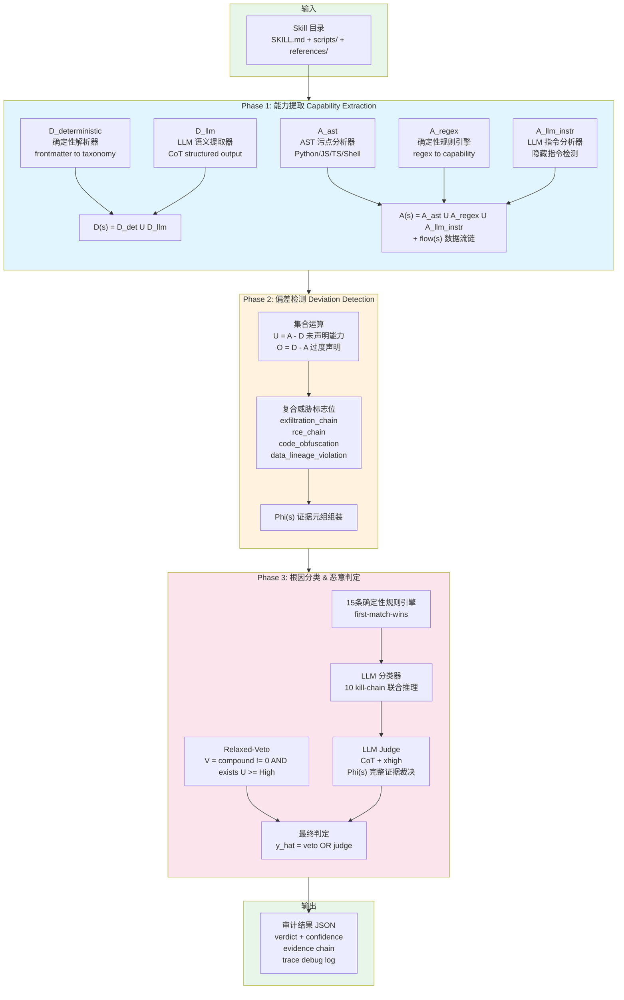
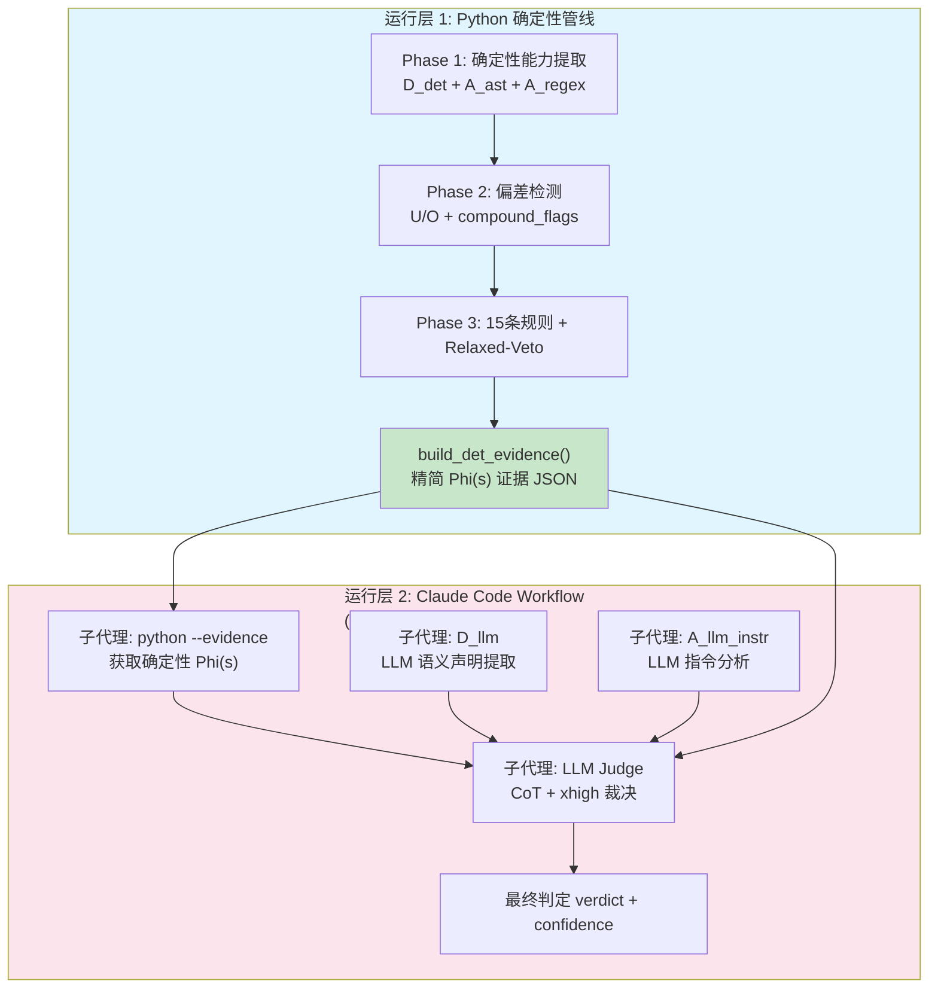
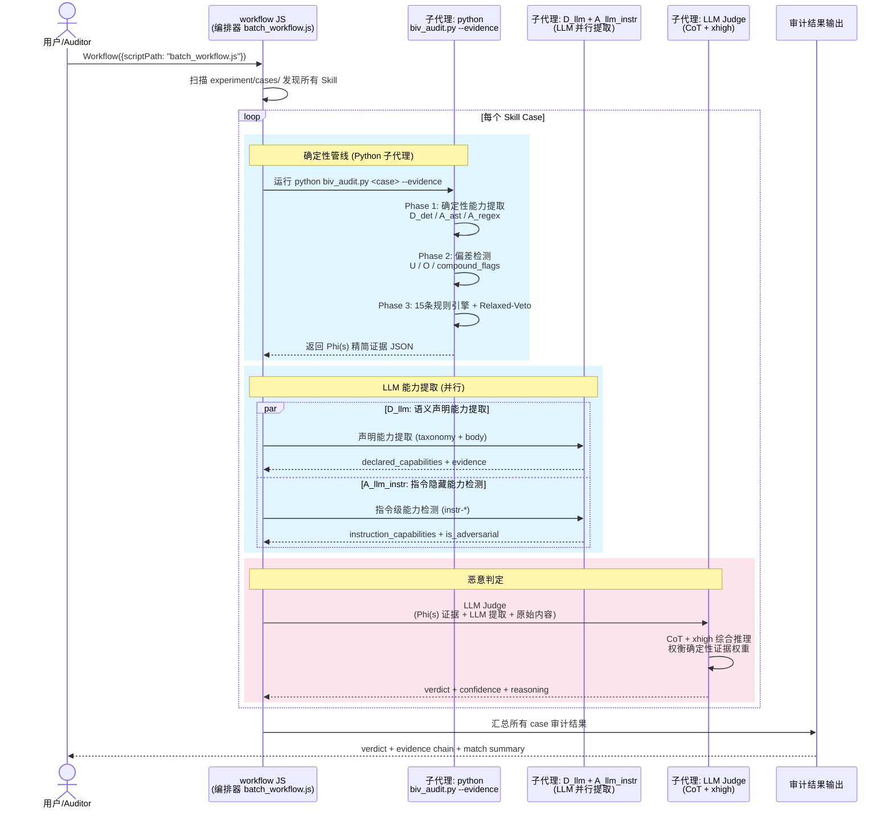
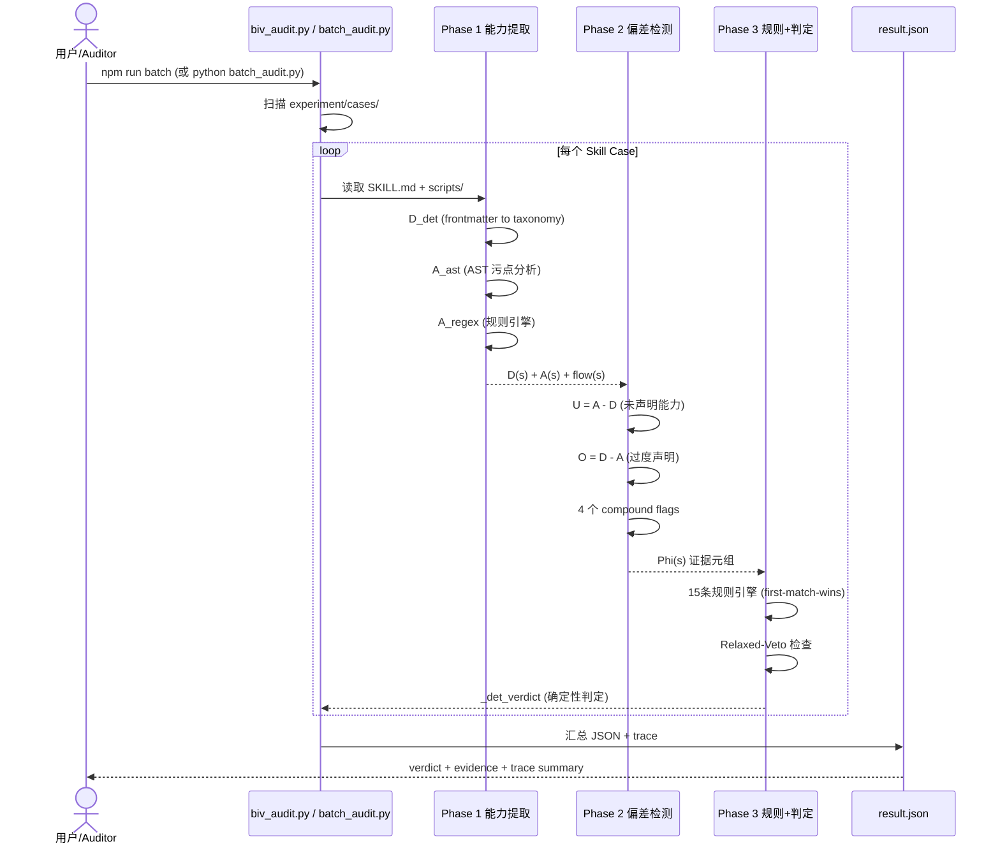
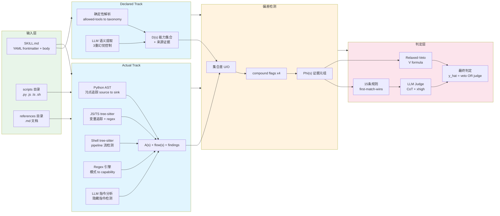
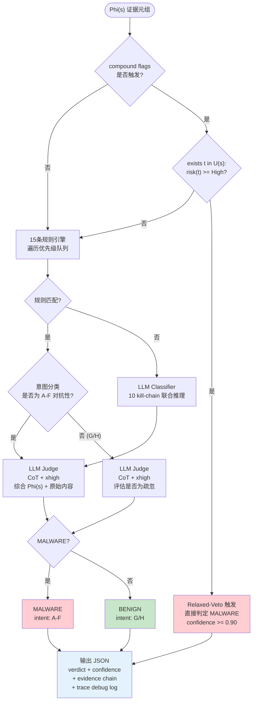
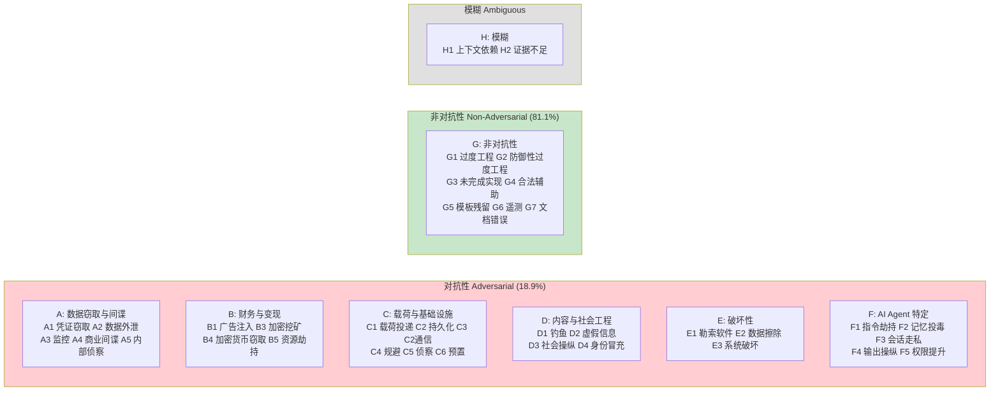
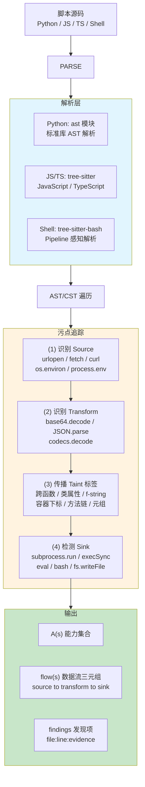

# BIV (Behavioral Integrity Verification) 系统文档

> 基于论文 *Behavioral Integrity Verification for AI Agent Skills* (Yuhao Wu et al., 2025, arXiv:2605.11770) 的严格复现。
>
> 输入一个 AI Agent Skill 目录，经过三阶段流水线分析，输出 `benign`（良性，可上架）或 `malware`（恶意，拒绝上架）的审计结论及完整证据链。

---

## 一、系统架构



---

## 一-b、双层运行架构

系统分为两个运行层，通过 `--evidence` 精简证据接口打通：



**两层分工**：

| 层 | 职责 | 产出 |
|----|------|------|
| Python 确定性层 | 静态分析、AST 污点、规则引擎、Relaxed-Veto | `Phi(s)` 精简证据 (纯确定性，无 LLM) |
| Workflow LLM 层 | D_llm / A_llm_instr / LLM Judge | 最终 verdict (综合 Phi(s) + LLM 提取) |

---

## 二、时序图 - 完整审计流程 (Workflow 含 LLM)



---

## 二-b、确定性流水线时序 (无 LLM, Python CLI)



---

## 三、数据流图 - 模块间数据传递



---

## 四、判定决策树 - 从偏差到最终结论



---

## 五、能力分类体系 (Taxonomy)

```mermaid
flowchart TB
    TAX["Taxonomy T<br/>7类 x 29项能力"]

    TAX --> NET["Network 网络<br/>risk: HIGH (4项)"]
    TAX --> FS["Filesystem 文件系统<br/>risk: MEDIUM (7项)"]
    TAX --> PROC["Process 进程执行<br/>risk: HIGH (4项)"]
    TAX --> ENV["Environment 环境变量<br/>risk: HIGH (3项)"]
    TAX --> ENC["Encoding 编码<br/>risk: MEDIUM (3项)"]
    TAX --> CRED["Credential 凭证<br/>risk: CRITICAL (3项)"]
    TAX --> INSTR["Instruction 指令级<br/>risk: CRITICAL (5项)"]

    NET --> NET1["net-http-out: HTTP 外发请求"]
    NET --> NET2["net-socket-out: Socket 外连"]
    NET --> NET3["net-inbound: 入站网络监听"]
    NET --> NET4["net-download-exec: 下载并执行"]

    FS --> FS1["fs-read-project"]
    FS --> FS2["fs-read-sensitive"]
    FS --> FS3["fs-read-home"]
    FS --> FS4["fs-write"]
    FS --> FS5["fs-write-sensitive"]
    FS --> FS6["fs-enumerate"]
    FS --> FS7["fs-delete"]

    PROC --> P1["proc-exec"]
    PROC --> P2["proc-exec-shell"]
    PROC --> P3["proc-code-eval"]
    PROC --> P4["proc-code-eval-dynamic"]

    INSTR --> I1["instr-override: 指令覆盖"]
    INSTR --> I2["instr-conceal: 指令隐藏"]
    INSTR --> I3["instr-identity-hijack: 身份劫持"]
    INSTR --> I4["instr-silent-exec: 静默执行"]
    INSTR --> I5["instr-exfil-instruction: 指令窃取"]

    style NET fill:#ffcdd2
    style PROC fill:#ffcdd2
    style ENV fill:#ffcdd2
    style INSTR fill:#ffcdd2
    style CRED fill:#ffcdd2
    style FS fill:#fff9c4
    style ENC fill:#fff9c4
```



---

## 六、意图分类体系 (Intent Taxonomy)



---

## 七、污点分析流程



---

## 八、项目结构

```
MAS4MalSkill/
├── package.json                    # npm scripts (batch/test)
├── docs/
│   ├── skill-scanner/              # 原有 skill scanner 文档
│   │   ├── SKILL.md
│   │   ├── references/             # 威胁模式参考文档
│   │   └── scripts/scan_skill.py   # 旧版 regex scanner
│   └── BIV-SYSTEM-DOCS.md          # 本文档
│
├── src/biv/                        # BIV 核心实现
│   ├── taxonomy.py                 # 7类x29能力 + 意图分类 + 规则 + kill-chain
│   ├── trace.py                    # 结构化调试追踪
│   ├── declared_track.py           # Module 1: D(s) 声明能力提取
│   ├── actual_track/
│   │   ├── ast_analyzer.py         # Module 2: AST 污点分析 (Python/JS/TS/Shell)
│   │   ├── regex_engine.py         # Module 2: Regex 模式 to capability 映射
│   │   └── llm_instruction.py      # Module 2: LLM 指令级能力提取
│   ├── deviation.py                # Module 3: 偏差检测 + compound flags
│   ├── root_cause.py               # Module 4: 15条规则引擎 + LLM 分类器
│   ├── malicious_detect.py         # Module 5: Relaxed-Veto + LLM Judge
│   └── orchestrator.py             # 3-Phase 编排器 + JSON 输出 + CLI
│                                    #   + build_det_evidence() (精简 Phi(s))
│
├── scripts/
│   ├── biv_audit.py                # 单 skill 审计 CLI
│   ├── batch_audit.py              # 批量审计 (确定性)
│   ├── biv_workflow.js             # Claude Code Workflow: LLM 编排
│   └── batch_workflow.js           # Claude Code Workflow: LLM 批量审计
│
└── experiment/cases/               # 测试用例
    ├── 000-jeremy...__CI_B4/       # Python dropper (恶意)
    │   ├── SKILL.md
    │   ├── scripts/content_validator.py
    │   └── .expected -> malware
    └── ai-wrapper-product__CI_B6/  # JS reverse shell (恶意)
        ├── SKILL.md
        ├── scripts/generateContent.js
        └── .expected -> malware
```

---

## 九、运行命令速查

| 命令 | 环境 | 说明 |
|------|------|------|
| `npm run test:smoke` | 终端 / CI | 确定性冒烟测试 (断言 2 case = malware) |
| `npm run batch` | 终端 / CI | 批量确定性审计 (汇总表) |
| `npm run batch:json` | 终端 / CI | 批量审计 to JSON 文件 |
| `npm run audit:jeremy` | 终端 | 单 case 审计 to result.json |
| `Workflow({scriptPath: "scripts/biv_workflow.js", args: {skill_dir: "..."}})` | Claude Code | 单 case 完整含 LLM |
| `Workflow({scriptPath: "scripts/batch_workflow.js"})` | Claude Code | 批量完整含 LLM |
| `python scripts/batch_audit.py --verbose` | 终端 | 批量审计 (详细输出) |

---

## 十、关键指标

| 指标 | 值 |
|------|-----|
| 能力分类 | 7 类 x 29 项 |
| 风险等级 | Critical / High / Medium |
| 意图分类 | 8 分支 x 36 叶子 |
| 确定性规则 | 15 条 (优先级队列) |
| Kill-Chain 模式 | 10 种 |
| Compound 威胁标志 | 4 个 |
| 支持脚本语言 | Python (ast) + JS/TS (tree-sitter) + Shell (tree-sitter-bash) |
| LLM 调用点 | 4 个 (D_llm, A_llm_instr, LLM Classifier, LLM Judge) |
| 幻觉控制 | 3 重 (taxonomy-echo, evidence grounding, keyword quality) |
| 确定性延迟 | ~20ms/case |
| 含 LLM 延迟 | 取决于模型响应 (~5-30s/case) |
