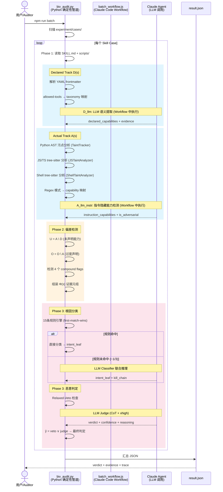

# BIV (Behavioral Integrity Verification) 系统文档

> 基于论文 *Behavioral Integrity Verification for AI Agent Skills* (Yuhao Wu et al., 2025, arXiv:2605.11770) 的严格复现。
>
> 输入一个 AI Agent Skill 目录，经过三阶段流水线分析，输出 `benign`（良性，可上架）或 `malware`（恶意，拒绝上架）的审计结论及完整证据链。

---

## 一、系统架构

```mermaid
graph TB
    subgraph 输入
        SKILL[Skill 目录<br/>SKILL.md + scripts/ + references/]
    end

    subgraph Phase1["Phase 1: 能力提取 (Capability Extraction)"]
        direction TB
        D_DET[D_deterministic<br/>确定性解析器<br/>frontmatter → taxonomy]
        D_LLM[D_llm<br/>LLM 语义提取器<br/>CoT structured output]
        A_AST[A_ast<br/>AST 污点分析器<br/>Python/JS/TS/Shell]
        A_REGEX[A_regex<br/>确定性规则引擎<br/>regex → capability 映射]
        A_LLM[A_llm_instr<br/>LLM 指令分析器<br/>隐藏指令检测]
        
        D_DET --> D_MERGE[D(s) = D_det ∪ D_llm]
        D_LLM --> D_MERGE
        A_AST --> A_MERGE[A(s) = A_ast ∪ A_regex ∪ A_llm_instr<br/>+ flow(s) 数据流链]
        A_REGEX --> A_MERGE
        A_LLM --> A_MERGE
    end

    subgraph Phase2["Phase 2: 偏差检测 (Deviation Detection)"]
        direction TB
        SETOPS[集合运算<br/>U = A \ D 未声明能力<br/>O = D \ A 过度声明]
        COMPOUND[复合威胁标志位<br/>exfiltration_chain<br/>rce_chain<br/>code_obfuscation<br/>data_lineage_violation]
        PHI[Φ(s) 证据元组组装]
        
        SETOPS --> COMPOUND --> PHI
    end

    subgraph Phase3["Phase 3: 根因分类 & 恶意判定"]
        direction TB
        RULES[15条确定性规则引擎<br/>first-match-wins]
        CLASSIFIER[LLM 分类器<br/>10 kill-chain 联合推理]
        VETO[Relaxed-Veto<br/>V = compound≠0 ∧ ∃U≥High]
        JUDGE[LLM Judge<br/>CoT + xhigh<br/>Φ(s) 完整证据裁决]
        VERDICT[最终判定<br/>ŷ = veto ∨ judge]
        
        RULES --> CLASSIFIER
        CLASSIFIER --> JUDGE
        VETO --> VERDICT
        JUDGE --> VERDICT
    end

    subgraph 输出
        JSON[审计结果 JSON<br/>verdict + confidence<br/>evidence chain<br/>trace debug log]
    end

    SKILL --> Phase1
    Phase1 --> Phase2
    Phase2 --> Phase3
    Phase3 --> JSON

    style Phase1 fill:#e1f5fe
    style Phase2 fill:#fff3e0
    style Phase3 fill:#fce4ec
    style 输入 fill:#e8f5e9
    style 输出 fill:#e8f5e9
```

---

## 二、时序图 — 完整审计流程



---

## 三、数据流图 — 模块间数据传递

```mermaid
flowchart LR
    subgraph Input[输入层]
        SKILL_MD[SKILL.md<br/>YAML frontmatter + body]
        SCRIPTS[scripts/*.py/*.js/*.ts/*.sh]
        REFS[references/*.md]
    end

    subgraph Track1[Declared Track]
        direction TB
        D1[确定性解析<br/>allowed-tools → taxonomy]
        D2[LLM 语义提取<br/>3重幻觉控制]
        D3[D(s) 能力集合<br/>+ 来源证据]
        D1 --> D3
        D2 --> D3
    end

    subgraph Track2[Actual Track]
        direction TB
        A1[Python AST<br/>污点追踪 source→sink]
        A2[JS/TS tree-sitter<br/>变量追踪 + regex]
        A3[Shell tree-sitter<br/>pipeline 流检测]
        A4[Regex 引擎<br/>模式 → capability]
        A5[LLM 指令分析<br/>隐藏指令检测]
        A1 --> A6[A(s) + flow(s) + findings]
        A2 --> A6
        A3 --> A6
        A4 --> A6
        A5 --> A6
    end

    subgraph Deviation[偏差检测]
        direction TB
        B1[集合差 U/O]
        B2[compound flags ×4]
        B3[Φ(s) 证据元组]
        A6 --> B1
        D3 --> B1
        B1 --> B2 --> B3
    end

    subgraph Verdict[判定层]
        direction TB
        C1[15条规则<br/>first-match-wins]
        C2[Relaxed-Veto<br/>V formula]
        C3[LLM Judge<br/>CoT + xhigh]
        C4[最终判定<br/>ŷ = veto ∨ judge]
        B3 --> C1 --> C3
        B3 --> C2 --> C4
        C3 --> C4
    end

    SKILL_MD --> Track1
    SKILL_MD --> Track2
    SCRIPTS --> Track2
    REFS --> Track2
    Track1 --> Deviation
    Track2 --> Deviation
    Deviation --> Verdict

    style Input fill:#e8f5e9
    style Track1 fill:#e1f5fe
    style Track2 fill:#e1f5fe
    style Deviation fill:#fff3e0
    style Verdict fill:#fce4ec
```

---

## 四、判定决策树 — 从偏差到最终结论

```mermaid
flowchart TD
    START([Φ(s) 证据元组]) --> COMPOUND{compound flags<br/>是否触发?}
    
    COMPOUND -->|否| RULE_CHECK[15条规则引擎<br/>遍历优先级队列]
    COMPOUND -->|是| VETO_CHECK{∃ τ ∈ U(s):<br/>risk(τ) ≥ High?}
    
    VETO_CHECK -->|否| RULE_CHECK
    VETO_CHECK -->|是| VETO_FIRE[Relaxed-Veto 触发<br/>直接判定 MALWARE<br/>confidence ≥ 0.90]
    
    RULE_CHECK --> RULE_MATCH{规则匹配?}
    RULE_MATCH -->|是| CLASSIFY_ADV{意图分类<br/>是否为 A-F 对抗性?}
    RULE_MATCH -->|否| LLM_CLASS[LLM Classifier<br/>10 kill-chain 联合推理]
    
    CLASSIFY_ADV -->|是| JUDGE_ADV[LLM Judge<br/>CoT + xhigh<br/>综合 Φ(s) + 原始内容]
    CLASSIFY_ADV -->|否 G/H| JUDGE_BEN[LLM Judge<br/>CoT + xhigh<br/>评估是否为疏忽]
    
    LLM_CLASS --> JUDGE_ADV
    
    JUDGE_ADV --> FINAL{MALWARE?}
    JUDGE_BEN --> FINAL
    
    VETO_FIRE --> FINAL_OUT[输出 JSON<br/>verdict + confidence<br/>+ evidence chain<br/>+ trace debug log]
    FINAL -->|是| MAL_OUT[MALWARE<br/>intent: A-F]
    FINAL -->|否| BEN_OUT[BENIGN<br/>intent: G/H]
    
    MAL_OUT --> FINAL_OUT
    BEN_OUT --> FINAL_OUT

    style VETO_FIRE fill:#ffcdd2
    style MAL_OUT fill:#ffcdd2
    style BEN_OUT fill:#c8e6c9
    style FINAL_OUT fill:#e3f2fd
```

---

## 五、能力分类体系 (Taxonomy 𝒯)

```mermaid
graph TB
    TAX[Taxonomy 𝒯<br/>7类 × 29项能力]
    
    TAX --> NET[Network 网络<br/>risk: HIGH<br/>4 项]
    TAX --> FS[Filesystem 文件系统<br/>risk: MEDIUM<br/>7 项]
    TAX --> PROC[Process 进程执行<br/>risk: HIGH<br/>4 项]
    TAX --> ENV[Environment 环境变量<br/>risk: HIGH<br/>3 项]
    TAX --> ENC[Encoding 编码<br/>risk: MEDIUM<br/>3 项]
    TAX --> CRED[Credential 凭证<br/>risk: CRITICAL<br/>3 项]
    TAX --> INSTR[Instruction 指令级<br/>risk: CRITICAL<br/>5 项]
    
    NET --> NET1[net-http-out<br/>HTTP 外发请求]
    NET --> NET2[net-socket-out<br/>Socket 外连]
    NET --> NET3[net-inbound<br/>入站网络监听]
    NET --> NET4[net-download-exec<br/>下载并执行]
    
    FS --> FS1[fs-read-project]
    FS --> FS2[fs-read-sensitive]
    FS --> FS3[fs-read-home]
    FS --> FS4[fs-write]
    FS --> FS5[fs-write-sensitive]
    FS --> FS6[fs-enumerate]
    FS --> FS7[fs-delete]
    
    PROC --> P1[proc-exec]
    PROC --> P2[proc-exec-shell]
    PROC --> P3[proc-code-eval]
    PROC --> P4[proc-code-eval-dynamic]
    
    INSTR --> I1[instr-override<br/>指令覆盖]
    INSTR --> I2[instr-conceal<br/>指令隐藏]
    INSTR --> I3[instr-identity-hijack<br/>身份劫持]
    INSTR --> I4[instr-silent-exec<br/>静默执行]
    INSTR --> I5[instr-exfil-instruction<br/>指令窃取]

    style NET fill:#ffcdd2
    style PROC fill:#ffcdd2
    style ENV fill:#ffcdd2
    style INSTR fill:#ffcdd2
    style CRED fill:#ffcdd2
    style FS fill:#fff9c4
    style ENC fill:#fff9c4
```



---

## 六、意图分类体系 (Intent Taxonomy)

```mermaid
graph LR
    subgraph Adversarial["对抗性 (Adversarial) — 18.9%"]
        A[分支 A: 数据窃取与间谍<br/>A1 凭证窃取 | A2 数据外泄<br/>A3 监控 | A4 商业间谍 | A5 内部侦察]
        B[分支 B: 财务与变现<br/>B1 广告注入 | B3 加密挖矿<br/>B4 加密货币窃取 | B5 资源劫持]
        C[分支 C: 载荷与基础设施<br/>C1 载荷投递 | C2 持久化 | C3 C2通信<br/>C4 规避 | C5 侦察 | C6 预置]
        D[分支 D: 内容与社会工程<br/>D1 钓鱼 | D2 虚假信息<br/>D3 社会操纵 | D4 身份冒充]
        E[分支 E: 破坏性<br/>E1 勒索软件 | E2 数据擦除 | E3 系统破坏]
        F[分支 F: AI Agent 特定<br/>F1 指令劫持 | F2 记忆投毒 | F3 会话走私<br/>F4 输出操纵 | F5 权限提升]
    end
    
    subgraph NonAdv["非对抗性 (Non-Adversarial) — 81.1%"]
        G[分支 G: 非对抗性<br/>G1 过度工程 | G2 防御性过度工程<br/>G3 未完成实现 | G4 合法辅助<br/>G5 模板残留 | G6 遥测 | G7 文档错误]
    end
    
    subgraph Amb["模糊"]
        H[分支 H: 模糊<br/>H1 上下文依赖 | H2 证据不足]
    end

    style Adversarial fill:#ffcdd2
    style NonAdv fill:#c8e6c9
    style Amb fill:#e0e0e0
```

---

## 七、污点分析流程

```mermaid
flowchart TB
    SOURCE_CODE[脚本源码<br/>Python/JS/TS/Shell] --> PARSE
    
    subgraph Parse[解析层]
        direction LR
        AST_PY[Python: ast 模块<br/>标准库 AST 解析]
        AST_JS[JS/TS: tree-sitter<br/>JavaScript/TypeScript]
        AST_SH[Shell: tree-sitter-bash<br/>Pipeline 感知]
    end
    
    PARSE --> Parse
    Parse --> WALK[AST/CST 遍历]
    
    subgraph Taint[污点追踪]
        direction TB
        S1[识别 Source<br/>urlopen/fetch/curl<br/>os.environ/process.env]
        S2[识别 Transform<br/>base64.decode/JSON.parse<br/>codecs.decode]
        S3[传播 Taint 标签<br/>跨函数/类属性/f-string<br/>容器下标/方法链/元组]
        S4[检测 Sink<br/>subprocess.run/execSync<br/>eval/bash/fs.writeFile]
    end
    
    WALK --> Taint
    
    S1 --> S2 --> S3 --> S4
    
    subgraph Output[输出]
        direction LR
        O1[A(s) 能力集合]
        O2[flow(s) 数据流三元组<br/>source → transform → sink]
        O3[findings 发现项<br/>file:line:evidence]
    end
    
    S4 --> Output
    
    style Parse fill:#e1f5fe
    style Taint fill:#fff3e0
    style Output fill:#c8e6c9
```

---

## 八、项目结构

```
MAS4MalSkill/
├── package.json                    # npm scripts (batch/test)
├── docs/
│   ├── skill-scanner/              # 原有 skill scanner 文档
│   │   ├── SKILL.md
│   │   ├── references/             # 威胁模式参考文档
│   │   └── scripts/scan_skill.py   # 旧版 regex scanner
│   └── BIV-SYSTEM-DOCS.md          # ← 本文档
│
├── src/biv/                        # BIV 核心实现
│   ├── taxonomy.py                 # 7类×29能力 + 意图分类 + 规则 + kill-chain
│   ├── trace.py                    # 结构化调试追踪
│   ├── declared_track.py           # Module 1: D(s) 声明能力提取
│   ├── actual_track/
│   │   ├── ast_analyzer.py         # Module 2: AST 污点分析 (Python/JS/TS/Shell)
│   │   ├── regex_engine.py         # Module 2: Regex 模式 → capability 映射
│   │   └── llm_instruction.py      # Module 2: LLM 指令级能力提取
│   ├── deviation.py                # Module 3: 偏差检测 + compound flags
│   ├── root_cause.py               # Module 4: 15条规则引擎 + LLM 分类器
│   ├── malicious_detect.py         # Module 5: Relaxed-Veto + LLM Judge
│   └── orchestrator.py             # 3-Phase 编排器 + JSON 输出 + CLI
│
├── scripts/
│   ├── biv_audit.py                # 单 skill 审计 CLI
│   ├── batch_audit.py              # 批量审计 (确定性)
│   ├── biv_workflow.js             # Claude Code Workflow: LLM 编排
│   └── batch_workflow.js           # Claude Code Workflow: LLM 批量审计
│
└── experiment/cases/               # 测试用例
    ├── 000-jeremy...__CI_B4/       # Python dropper (恶意)
    │   ├── SKILL.md
    │   ├── scripts/content_validator.py
    │   └── .expected → "malware"
    └── ai-wrapper-product__CI_B6/  # JS reverse shell (恶意)
        ├── SKILL.md
        ├── scripts/generateContent.js
        └── .expected → "malware"
```

---

## 九、运行命令速查

| 命令 | 环境 | 说明 |
|------|------|------|
| `npm run test:smoke` | 终端 / CI | 确定性冒烟测试 (断言 2 case = malware) |
| `npm run batch` | 终端 / CI | 批量确定性审计 (汇总表) |
| `npm run batch:json` | 终端 / CI | 批量审计 → JSON 文件 |
| `npm run audit:jeremy` | 终端 | 单 case 审计 → result.json |
| `Workflow({scriptPath: "scripts/biv_workflow.js", args: {skill_dir: "..."}})` | Claude Code | 单 case 完整含 LLM |
| `Workflow({scriptPath: "scripts/batch_workflow.js"})` | Claude Code | 批量完整含 LLM |
| `python scripts/batch_audit.py --verbose` | 终端 | 批量审计 (详细输出) |

---

## 十、关键指标

| 指标 | 值 |
|------|-----|
| 能力分类 | 7 类 × 29 项 |
| 风险等级 | Critical / High / Medium |
| 意图分类 | 8 分支 × 36 叶子 |
| 确定性规则 | 15 条 (优先级队列) |
| Kill-Chain 模式 | 10 种 |
| Compound 威胁标志 | 4 个 |
| 支持脚本语言 | Python (ast) + JS/TS (tree-sitter) + Shell (tree-sitter-bash) |
| LLM 调用点 | 4 个 (D_llm, A_llm_instr, LLM Classifier, LLM Judge) |
| 幻觉控制 | 3 重 (taxonomy-echo, evidence grounding, keyword quality) |
| 确定性延迟 | ~20ms/case |
| 含 LLM 延迟 | 取决于模型响应 (~5-30s/case) |
