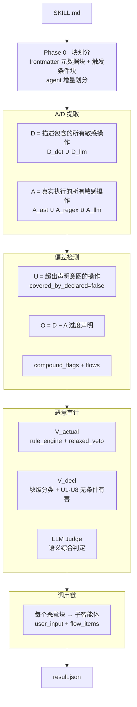
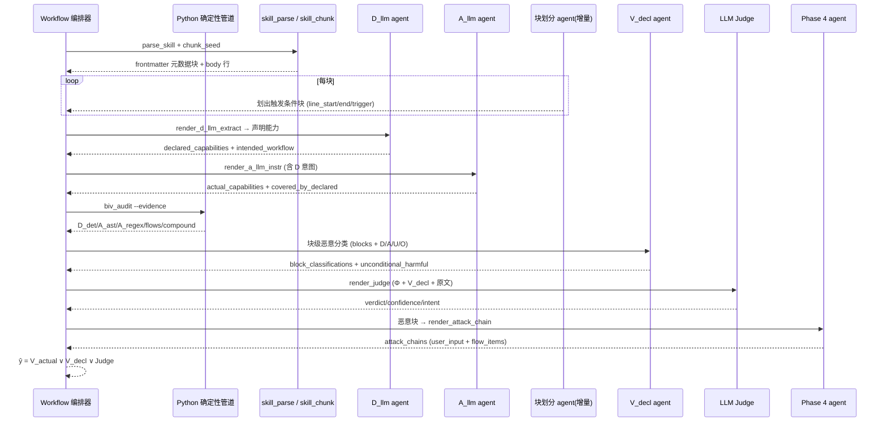
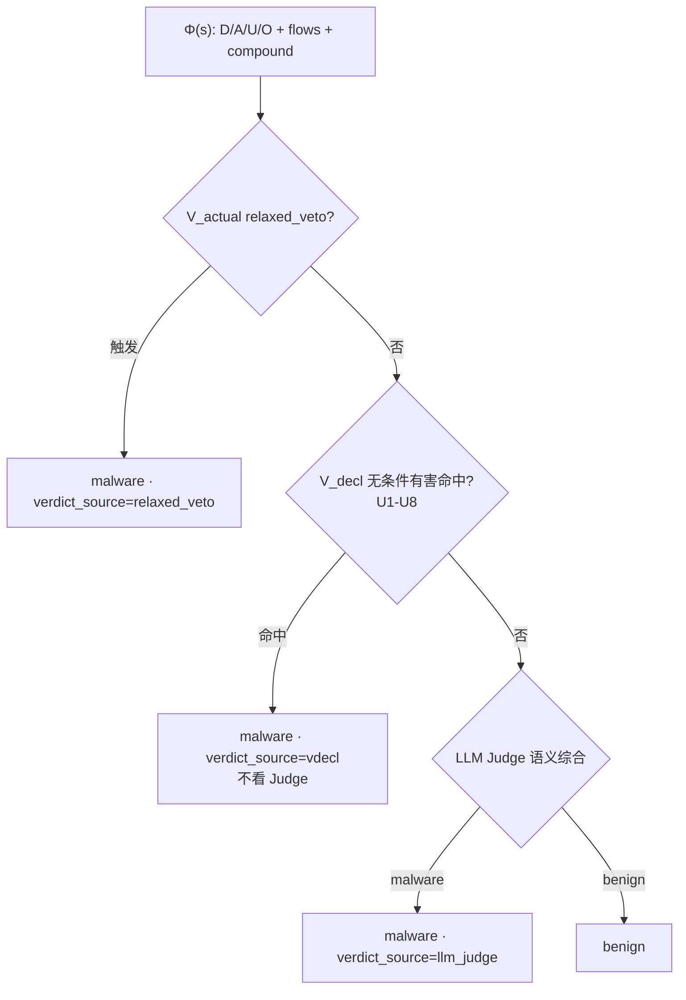
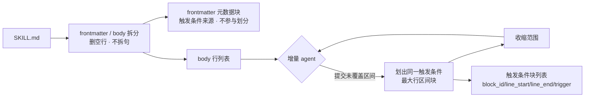
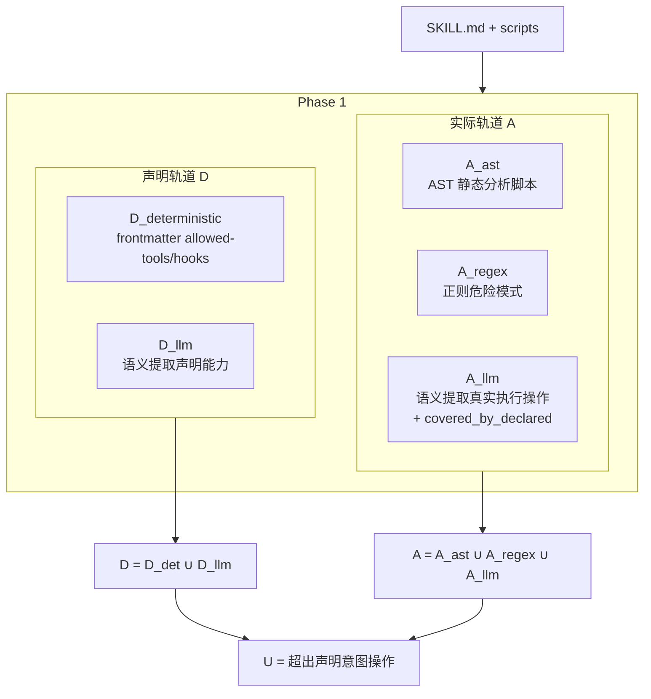
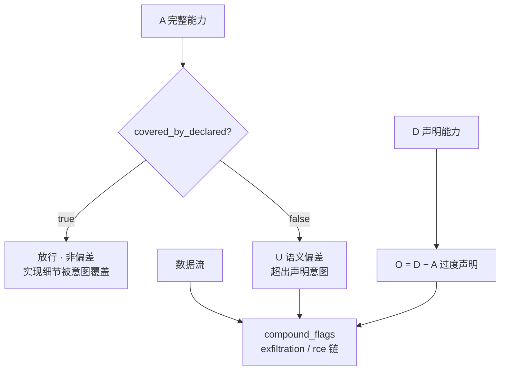
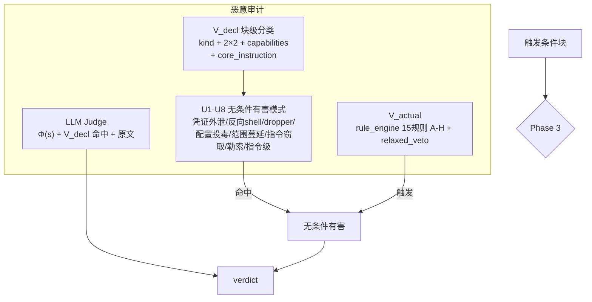
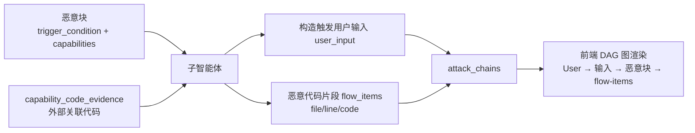

# BIV 系统示意图（Mermaid）

> 日期：2026-08-14
> 依据当前架构（Phase 0-4，意图覆盖偏差 + 触发条件块）。替代过时的 `BIV-SYSTEM-DOCS.md`。

## 1. 系统架构图

## 2. 完整审计时序图

## 3. 恶意判定流程图

## 4. Phase 0 — 块划分

## 5. Phase 1 — A/D 能力提取

## 6. Phase 2 — 偏差检测

## 7. Phase 3 — 恶意审计（三层判定）

## 8. Phase 4 — 恶意调用链

