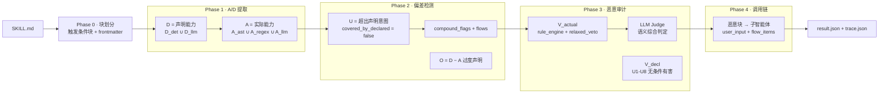
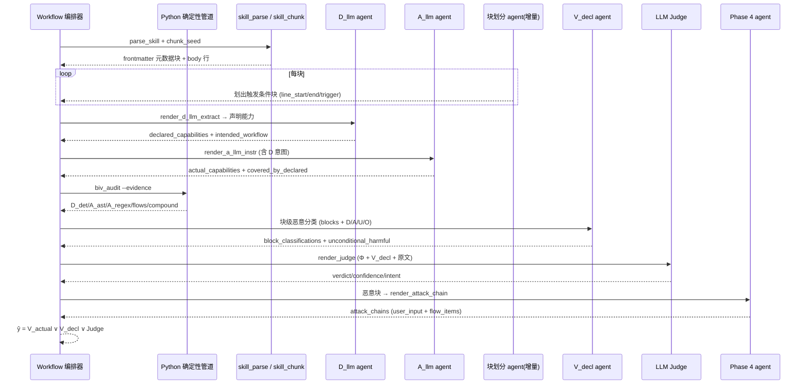
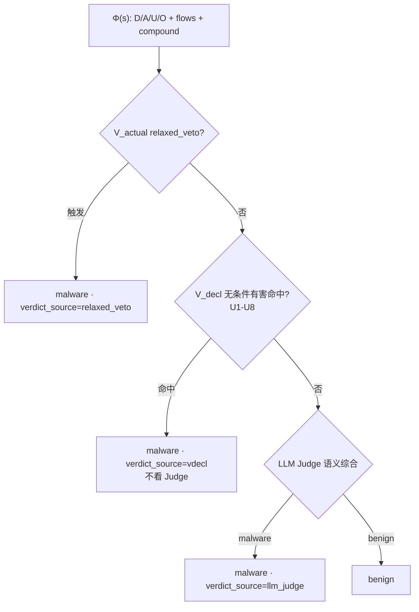
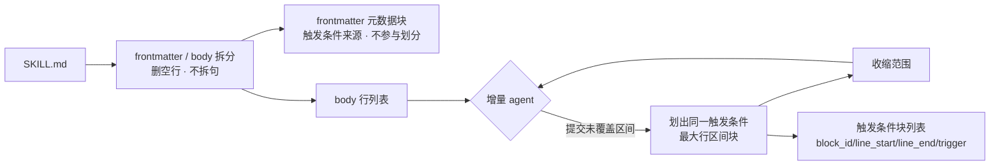
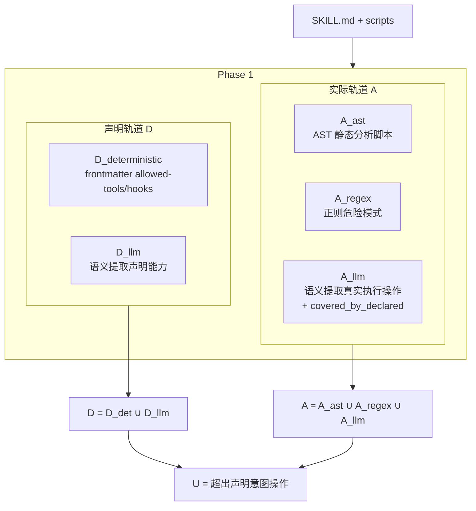
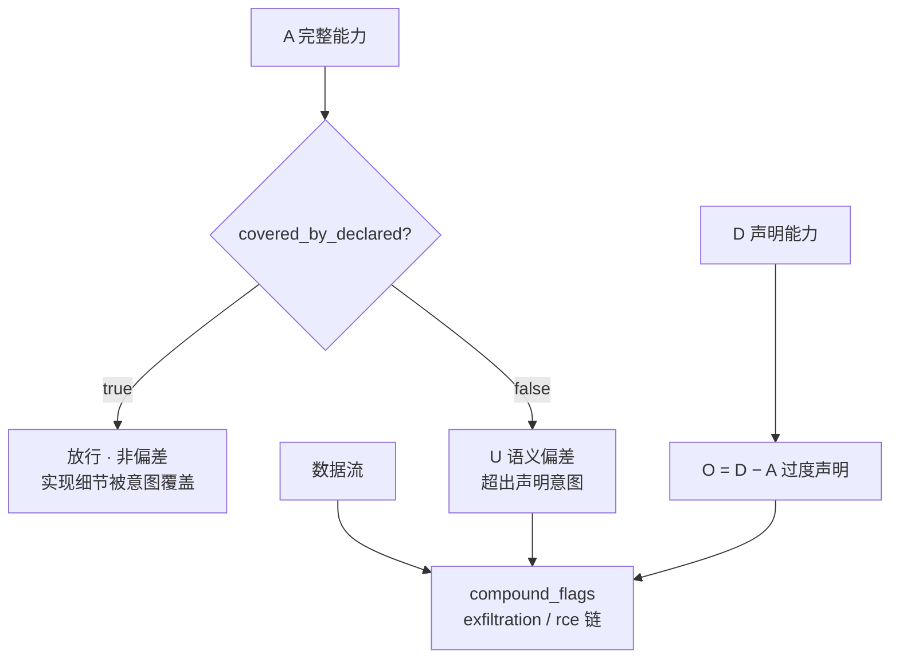
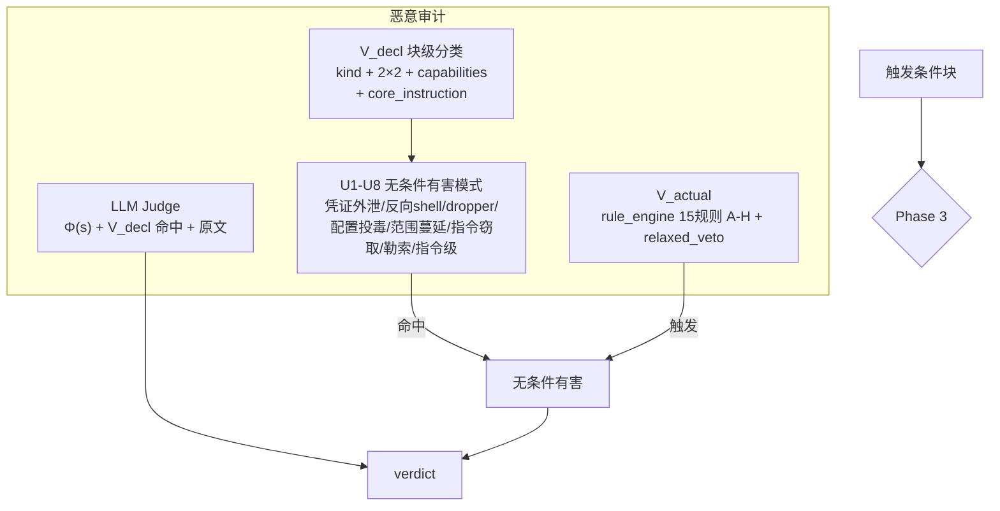
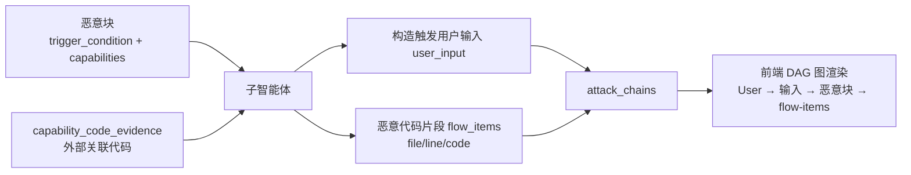
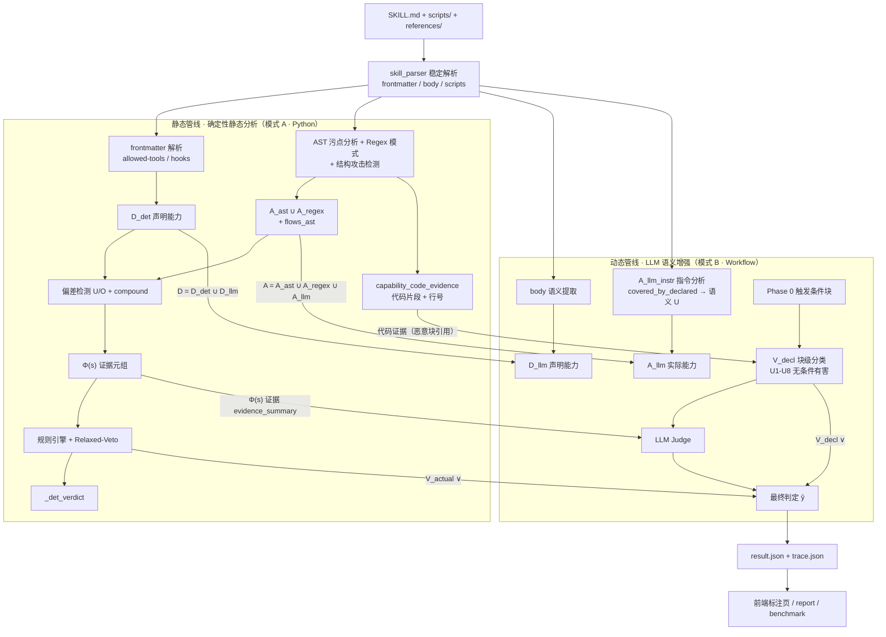
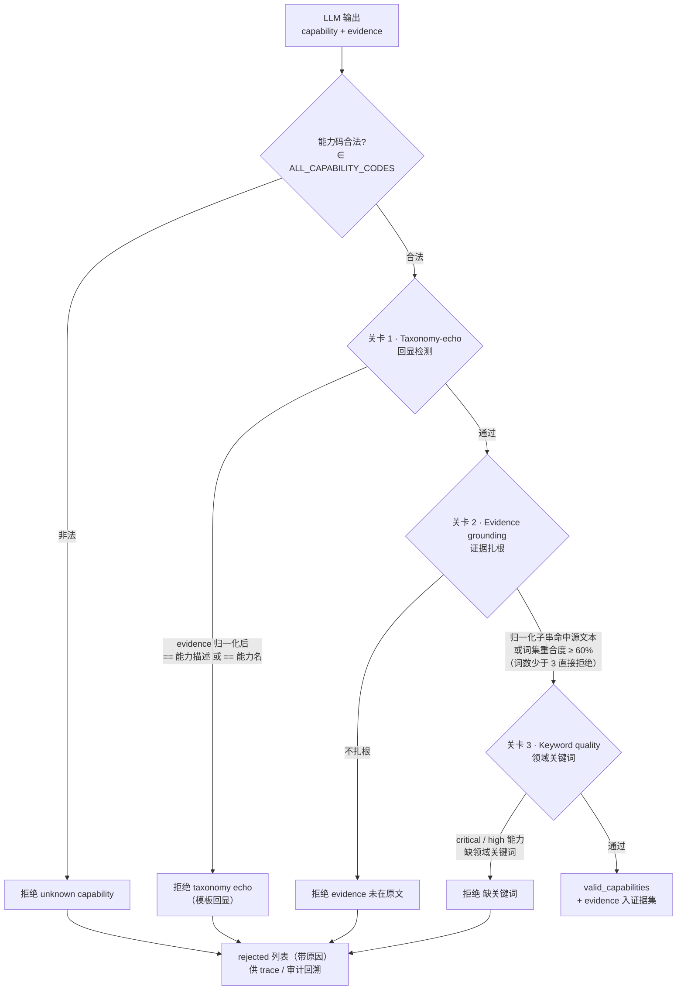

# BIV 系统示意图（Mermaid）

> 日期：2026-08-14
> 依据当前架构（Phase 0-4，意图覆盖偏差 + 触发条件块）。替代过时的 `BIV-SYSTEM-DOCS.md`。

## 1. 系统架构图

## 2. 完整审计时序图

## 3. 恶意判定流程图

## 4. Phase 0 — 块划分

## 5. Phase 1 — A/D 能力提取

## 6. Phase 2 — 偏差检测

## 7. Phase 3 — 恶意审计（三层判定）

## 8. Phase 4 — 恶意调用链

## 9. 单 case 审计：静态管线 × 动态管线（数据传递）

> 两条管线共享 `skill_parser` 解析产物；静态管线的确定性证据（Φ(s)、代码证据、det 判定）是动态管线 LLM Judge 与 V_decl 的输入；D/A 能力集双轨合并后进入最终判定 `ŷ = V_actual ∨ V_decl ∨ Judge`。

## 10. LLM 三重幻觉控制

> 对 LLM 提取的声明/指令能力做落库前校验，三道关卡逐项过滤。声明轨（`declared_track.validate_llm_output`）完整三道；指令轨（`llm_instruction.validate_instruction_llm_output`）为变体（能力类别限制 + 扎根阈值 50%）。详见 `docs/system-spec.md` §13.5。

