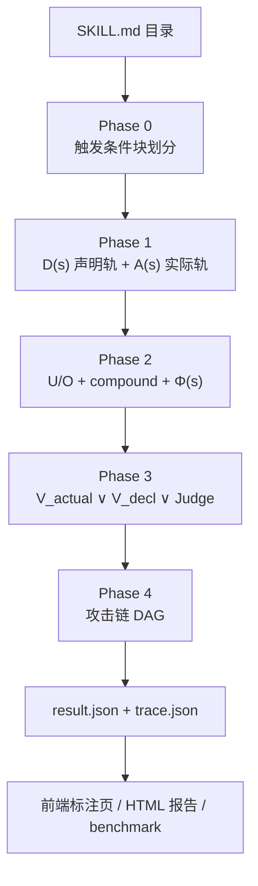

# BIV 系统说明书（System Specification）

> **BIV4MalSkillAudit** — Behavioral Integrity Verification for AI Agent Skills
>
> 版本：v2.0（2026-08-17）　·　仓库：`auto-water/BIV4MalSkillAudit`　·　来源：复现论文 *Behavioral Integrity Verification for AI Agent Skills*（Yuhao Wu et al., 2025, arXiv:2605.11770）
>
> **分工声明**：论文 BIV 工作聚焦于**行为完整性**——即"声明 vs 实际"的双轨验证框架、能力 Taxonomy、偏差定义、Relaxed-Veto 判定等核心判定内核。本文档所述系统中，**其余部分逻辑**（Phase 0 触发块划分、Workflow 多智能体编排、提示词管理、数据模型、可视化前端、U1-U8 块级识别、攻击链重构等）**由本仓库作者开发填充**。凡属作者填充部分，正文中以「工程实现」标注。

---

## 目录

- **摘要**
- **壹 全局视图**
  - 1　设计思想：声明/实际双轨验证
  - 2　要解决的问题
  - 3　核心假设
  - 4　术语对照表
  - 5　技术栈与运行环境
- **贰 端到端旅程**
  - 6　审计一单 case 的完整数据流
  - 7　快速入门
- **叁 分阶段细节**
  - 8　Phase 0　块划分
  - 9　Phase 1　能力提取
  - 10　Phase 2　偏差检测
  - 11　Phase 3　恶意审计
  - 12　Phase 4　攻击链
- **肆 支撑层**
  - 13　多智能体编排（Harness）
  - 14　提示词管理
  - 15　数据模型
  - 16　可视化
- **伍 验证与工程**
  - 17　基准与判分
  - 18　已知边界与安全设计
  - 19　目录结构
- **附录**
  - A　U1–U8 无条件有害模式清单
  - B　15 条确定性规则表
  - C　10 条杀伤链与 4 个复合威胁标志
  - D　8 分支 × 36 叶意图树

---

## 摘要

BIV（Behavioral Integrity Verification，行为完整性验证）是一个对 **AI Agent Skill**（如 Claude Code Skills）做**上架前安全审计**的多智能体系统。

**输入**：一个 Skill 目录（`SKILL.md` + 可选 `scripts/` 脚本 + 可选 `references/` 参考文档）。

**输出**：`benign`（良性，可上架）或 `malware`（恶意，拒绝上架）的判定，附带完整证据链：声明能力 D(s)、实际能力 A(s)、偏差 U/O、数据流、复合威胁标志、根因分类、逐块恶意标注、攻击链，以及结构化调试追踪（trace）。

**核心思想**：一个 Skill 是否恶意，不取决于它"看起来做了危险的事"，而取决于它**声明做什么**与**实际做什么**是否一致，以及**意图覆盖之外的行为**是否有害。系统用一条确定性管线 + 一个 LLM 增强管线双轨协同，在**可审计**与**语义理解**之间取得平衡。

---

## 壹　全局视图

## 1　设计思想：声明/实际双轨验证

### 1.1 核心问题

AI Agent Skill 是一种可被 Agent 自动加载并执行的"指令包"。攻击者可以制作一个功能看似正常的 Skill，把恶意代码藏进脚本、把恶意指令藏进正文、把破坏性声明隐藏在不显眼的角落。与普通软件不同的是：

- Skill 的**意图由自然语言描述**（`SKILL.md` body），而**行为由代码实现**（脚本）；
- 两者之间存在天然的**抽象差距**——自然语言可以含糊，代码可以绕道；
- 用户（或市场）在审核时，往往只能看到声明，看不到执行细节。

因此，静态"危险代码扫描"远远不够：一个良性密码管理器同样会读凭证、一个良性下载工具同样会发起网络请求。**行为完整性**的视角是：**它声明的，是不是它实际做的？没声明的部分，是不是无条件的伤害？**

### 1.2 双轨验证

设一个 Skill 为 `s`，定义两个集合（均由能力码构成，见 §1.5 Taxonomy）：

| 符号 | 含义 | 提取来源 |
|------|------|---------|
| **D(s)** | **声明**能力：skill 文本描述/包含的所有敏感操作 | frontmatter（`allowed-tools`、`hooks`）+ body 语义提取 |
| **A(s)** | **实际**能力：skill 实际执行的所有敏感操作 | AST 污点分析 + 正则模式 + LLM 指令分析 |

然后定义偏差：

```
U(s) = A(s) − D(s)   未声明/欠规格（实际做了但没声明 → 可疑）
O(s) = D(s) − A(s)   过度声明/过规格（声明了但没做 → 无害冗余）
```

**U 的语义修正**（工程实现）：在 LLM 轨中，U 不再采用严格的集合差，而是由 A 提取器对每个实际操作判断 `covered_by_declared`（是否被声明意图覆盖）。一个操作"被声明意图覆盖"则放行；`covered_by_declared == false` 的操作进入 U。这是为了弥合"声明意图能覆盖的语义范围"与"能力码集合差"之间的差异——比如声明"访问用户 GitHub 仓库"能语义覆盖"读取 ~/.gitconfig"，但集合差会误判。

### 1.3 判定信号

对每一阶段，系统累积三类证据：

- **Φ(s)**：偏差状态向量 `⟨D, A, U, O, flows, compound⟩`——是喂给所有下游判定器的统一证据元组；
- **flows**：数据流三元组 `{source, source_location, transforms, sink, sink_location}`，记录"哪个能力的数据流到了哪个能力"；
- **compound**：4 位复合威胁标志（`exfiltration_chain` / `rce_chain` / `code_obfuscation` / `data_lineage_violation`），表示多条能力的**组合**构成威胁。

### 1.4 三层判定（ŷ 的构成）

最终判定由三个通道**或（∨）**组合：

```
ŷ(s) = V_actual(s) ∨ V_decl(s) ∨ Judge(s)
```

| 通道 | 触发条件 | 性质 | verdict_source |
|------|---------|------|---------------|
| **V_actual** | 确定性硬否决（Relaxed-Veto）：任一复合威胁标志命中 **且** U 中存在风险 ≥ High 的未声明能力 | 确定性、无参数、可审计 | `relaxed_veto` |
| **V_decl** | 声明轨道恶意通道：某块声明的动作本身**无条件有害**（U1–U8 命中），不看上下文 | LLM 语义判定、命中即恶意 | `vdecl` |
| **Judge** | LLM 最终法官：以 Φ(s) 证据 + V_decl 命中 + skill 原文为输入，给出二元判定 | LLM、最强推理 | `llm_judge` |

组合规则（`final_verdict`）：

| V_actual 触发 | Judge 判定 | 结果 | 置信度 |
|:---:|:---:|------|------|
| ✓ | malware | `malware`（`both`） | `max(0.95, llm_conf)` |
| ✓ | benign | `malware`（`relaxed_veto`，**否决覆盖 LLM**） | 0.90 |
| ✗ | malware | `malware`（`llm_judge`） | `llm_conf` |
| ✗ | benign | `benign`（`llm_judge`） | `llm_conf` |

V_decl 命中时，`verdict` 直接置为 `malware`、`verdict_source='vdecl'`、`confidence = max(0.9, judge_conf)`。

### 1.5 Taxonomy：能力分类体系（论文内核）

全部能力收敛为 **7 类 × 29 能力**，每类带风险分级：

| 类别 | 风险 | 能力数 | 能力码 |
|------|------|:---:|------|
| Network 网络 | HIGH | 4 | `net-http-out`、`net-socket-out`、`net-inbound`、`net-download-exec` |
| Filesystem 文件系统 | MEDIUM | 7 | `fs-read-project`、`fs-read-sensitive`、`fs-read-home`、`fs-write`、`fs-write-sensitive`、`fs-enumerate`、`fs-delete` |
| Process 进程执行 | HIGH | 4 | `proc-exec`、`proc-exec-shell`、`proc-code-eval`、`proc-code-eval-dynamic` |
| Environment 环境变量 | HIGH | 3 | `env-access-specific`、`env-access-bulk`、`env-access-sensitive` |
| Encoding 编码转换 | MEDIUM | 3 | `enc-base64`、`enc-crypto`、`enc-compression` |
| Credential 凭证 | CRITICAL | 3 | `cred-read`、`cred-create`、`cred-transmit` |
| Instruction 指令级 | CRITICAL | 5 | `instr-override`、`instr-conceal`、`instr-identity-hijack`、`instr-silent-exec`、`instr-exfil-instruction` |

能力码是**整个系统的通用语言**：声明轨与实际轨都产能力码，偏差检测对能力码做集合运算，前端对能力码着色、关联代码证据。

### 1.6 三阶段 + 零阶段 + 攻击链的流水线

```
Phase 0  块划分      SKILL.md → 触发条件块（后续所有标注的基本单元）
Phase 1  能力提取     D(s) 声明轨 + A(s) 实际轨 → 能力集合 + 数据流
Phase 2  偏差检测     U/O、compound flags、Φ(s) → 偏差状态
Phase 3  恶意审计     ŷ = V_actual ∨ V_decl ∨ Judge → 判定 + 根因
Phase 4  攻击链       对恶意块重构用户输入 → 攻击链 DAG
```

各阶段详情见第 8–12 章。

---

## 2　要解决的问题

### 2.1 直接问题：Skill 上架前审计

| 问题 | 说明 |
|------|------|
| **恶意隐藏** | 恶意代码藏在脚本中、恶意指令藏在正文中、破坏性声明被刻意模糊 |
| **声明欺骗** | Skill 声明"读取项目文件"，实际读 `~/.ssh`；声明"调用 API"，实际外泄数据 |
| **无偏差恶意** | 声明与实际一致，但声明的动作本身无条件有害（如反向 shell、凭证外泄） |
| **安全类误报** | 良性 Skill（如密码管理器）诚实声明敏感能力，静态规则容易误判为恶意 |
| **跨语言盲区** | Python/JS/Shell 的静态分析能力不一致，JS/Shell 污点追踪弱 |
| **证据可审计** | 判定必须可回溯：为什么判恶意？哪条证据链？哪个代码片段？ |

### 2.2 工程问题（作者填充）

| 问题 | 方案 |
|------|------|
| 长 SKILL.md 单次分类超限 | Phase 0 触发块划分 + 分批 + 补测（见 §8、§13.4） |
| LLM 幻觉（编造证据、回显模板） | 三重幻觉控制（见 §13.5） |
| 提示词双份漂移 | 单一权威 `prompts.py` + 渲染管线（见 §14） |
| 判定不可调试 | trace/result 分离 + `agent_calls`/`decisions` 埋点（见 §15.3） |
| 结果不可视 | 六色块标注页 + HTML 报告 + 攻击链 DAG（见 §16） |
| 批次可判分 | benchmark：Acc/Prec/Recall/F1/FPR/FNR（见 §17） |

---

## 3　核心假设

### 3.1 判定假设

- **A1 恶意 ⟺ 违背意愿且有害**：一个 Skill 是恶意的，当且仅当它违背用户意愿（声明与实际不匹配）**且**很可能造成负面影响（存在高风险未声明能力）。这是本系统判定的第一性原理。
- **A2 无条件有害存在**：存在一类动作，**不存在任何合理的用户授权或合法使用场景**（如反向 shell、凭证外泄到不受信域名）。命中即恶意，不看上下文。
- **A3 声明必须覆盖实际**：声明意图覆盖的实际操作放行；未覆盖的操作可疑。

### 3.2 能力假设

- **A4 能力码可枚举**：所有敏感操作可收敛为 29 个能力码；能力码足以区分"读项目文件"与"读凭证"这类语义差异。
- **A5 风险可排序**：能力带风险分级（critical/high/medium），Relaxed-Veto 需要"至少一个 ≥ High 的未声明能力"。

### 3.3 数据假设

- **A6 ground truth 来自目录路径**：`benign/`/`malware/` 目录段即真实标签，**不读 `.expected` 文件**——防止把答案泄漏进审计上下文。
- **A7 声明可解析**：`SKILL.md` 的 YAML frontmatter 格式良好（或可回退到手写键值解析）；正文是自然语言。

### 3.4 工程假设

- **A8 多智能体 harness 有边界**：Workflow subagent **无法访问文件系统、无法执行 shell**，只能通过 Agent 工具调用 Python CLI 子进程获取确定性结果（见 §13）。
- **A9 LLM 调用只在 Claude Code 运行时内**：无需 `.env` 配置，不依赖外部 API key。
- **A10 trace 与 result 永不混同**：调试追踪独立成文件，result 仅经 `_meta.trace_ref` 引用。

---

## 4　术语对照表

### 4.1 核心判定概念

| 术语 | 全称 | 含义 |
|------|------|------|
| BIV | Behavioral Integrity Verification | 行为完整性验证：声明 vs 实际的偏差审计框架 |
| D(s) | Declared capabilities | 声明能力集（frontmatter + body） |
| A(s) | Actual capabilities | 实际能力集（AST + regex + LLM 指令） |
| U(s) | Undeclared | 未声明能力（`covered_by_declared==false`，非严格集合差） |
| O(s) | Overdeclared | 过度声明能力（`D − A`） |
| Φ(s) | Phi | 偏差状态向量 `⟨D, A, U, O, flows, compound⟩` |
| ŷ | final verdict | 最终判定 `V_actual ∨ V_decl ∨ Judge` |
| V_actual | Relaxed-Veto | 确定性硬否决（compound ∧ 高危未声明） |
| V_decl | 声明轨道恶意 | U1–U8 无偏差恶意识别 |
| Judge | LLM Judge | 最终二元法官 |
| covered_by_declared | 意图覆盖 | 实际操作是否被声明意图语义覆盖 |

### 4.2 阶段

| 术语 | 含义 |
|------|------|
| Phase 0 | 块划分：把 SKILL.md 切成触发条件块 |
| Phase 1 | 能力提取：D/A 双轨 |
| Phase 2 | 偏差检测：U/O、compound、Φ(s) |
| Phase 3 | 恶意审计：三层判定 + 根因分类 |
| Phase 4 | 攻击链：恶意块 → 用户输入 + 流项 → DAG |

### 4.3 块与标注

| 术语 | 含义 |
|------|------|
| trigger-condition block | 触发条件块：同一触发条件下执行的最大行区间（Phase 0 产物） |
| block_id | 块全局编号（后续所有标注以块为单位，替代"句"） |
| action_instruction / non_action | 块分类：动作指令块 / 非动作块 |
| 2×2 classification | 四象限分类：no/deviation × benign/malicious |
| coverage | 标注覆盖率：`classified_blocks / total_blocks`，要求 100% |

### 4.4 检测通道

| 术语 | 含义 |
|------|------|
| compound flags | 4 复合威胁标志：`exfiltration_chain`/`rce_chain`/`code_obfuscation`/`data_lineage_violation` |
| kill-chain | 杀伤链模板（10 条），描述攻击环节序列 |
| U1–U8 | 8 种无条件有害模式（V_decl 识别维度，见附录 A） |
| Relaxed-Veto | 放松否决：`compound ≠ 0 ∧ ∃τ∈U: risk(τ) ≥ High` |
| hallucination control | 三重幻觉控制：证据扎根 + 模板回显拒绝 + 关键词质量检查 |

### 4.5 数据与输出

| 术语 | 含义 |
|------|------|
| result.json | 确定性管线输出（`run_deterministic_pipeline`） |
| final-result | 完整 LLM 管线最终输出（`assemble_final_output`） |
| trace.json | 调试追踪（与 result 分离） |
| capability_code_evidence | 能力 → 代码片段+行号映射（前端点击查看） |
| verdict_source | 判定来源：`relaxed_veto`/`vdecl`/`llm_judge`/`both`/`deterministic_rule` |

### 4.6 运行模式

| 术语 | 含义 |
|------|------|
| 模式 A | Python 确定性模式（无 LLM，任意主机，快速预筛/CI） |
| 模式 B | Workflow 全流程（Claude Agent，LLM 增强，最强推理） |

---

## 5　技术栈与运行环境

### 5.1 语言与运行时

| 依赖 | 版本 | 用途 |
|------|------|------|
| Python | ≥ 3.9 | 确定性流水线（核心） |
| Node.js | ≥ 18 | npm scripts / Workflow |
| Claude Code CLI | 最新 | LLM 调用（Agent 工具） |

### 5.2 Python 依赖

| 包 | 用途 |
|----|------|
| `pyyaml` | YAML frontmatter 解析 |
| `tree-sitter` | JS/TS/Shell 语法树 |
| `tree-sitter-javascript` | JS/TS 分析 |
| `tree-sitter-typescript` | TS 分析 |
| `tree-sitter-bash` | Shell 分析 |

### 5.3 脚本语言覆盖（AST 污点分析）

| 语言 | 解析技术 | 追踪深度 |
|------|---------|---------|
| Python | 标准库 `ast` | **跨函数污点流**：参数注入、函数间传播、返回 taint、类属性、别名解析 |
| JavaScript / TS | `tree-sitter` | 变量级 + 模板字符串内插 + 间接源 |
| Shell | `tree-sitter-bash` | 管道流检测 + 反向 shell + 下载执行 |

### 5.4 前端 / 可视化

| 技术 | 用途 |
|------|------|
| 自包含 HTML（内联 CSS/JS） | per-case 标注页 + 批量报告，浏览器直接打开 |
| 原生 JS/SVG 贝塞尔 DAG | 攻击链图（模拟 Cytoscape.js + Dagre 视觉，零依赖） |
| mermaid | 系统示意图（`docs/system-diagrams.md`，8 张） |

---

## 贰　端到端旅程

## 6　审计一单 case 的完整数据流

> 这一章给出一条主线：一个 Skill 目录从进入到产出判定的完整旅程。细节在各阶段章节展开。



### 6.1 一次审计发生了什么（文字版）

1. **解析**：`skill_parser.parse_skill_dir` 稳定解析目录——frontmatter、body、`content_full`（全文）、`scripts`（可执行脚本列表）、`non_executable`、目录结构摘要。
2. **确定性管线**（Python，模式 A 的全部；模式 B 的基础）：
   - Phase 1：声明轨解析 frontmatter 的 `allowed-tools`/`hooks` 映射出 `D_det`；实际轨对全部脚本做 AST 污点分析（`A_ast` + `flows_ast`）+ 正则模式扫描（`A_regex` + findings）+ 结构攻击检测。同时组装 `capability_code_evidence`。
   - Phase 2：`U = A − D`、`O = D − A`、4 个 compound flags、`Φ(s)` 证据元组。
   - Phase 3（确定性部分）：15 条规则引擎 `first-match-wins` 命根因；Relaxed-Veto 检查；产出 `_det_verdict`。
   - 同时产出：`phase0` 块结构、`classification` 四象限、`capability_counts`、`_meta`。
3. **LLM 增强管线**（仅模式 B）：
   - Phase 0：IncrementalAgent 把 body 增量划分为触发条件块（见 §8）。
   - D_llm 语义提取声明能力 → 与 D_det 合并。
   - A_llm_instr 提取指令级实际能力 + 判断每个实际操作的 `covered_by_declared` → 语义 U。
   - V_decl 块级分类：每块打 2×2 标签，U1–U8 命中即 `unconditional_harmful`。
   - Judge：以 Φ(s) 证据 + V_decl 命中 + skill 原文判定 `benign/malware`。
   - Phase 4：对恶意块重构 `user_input + flow_items` 攻击链。
4. **落盘**：每 case 的 result.json（含确定性 + LLM 合并结果）与 trace.json 分离写入镜像目录。

### 6.2 两轨并行、最终合并

- **det-track**（确定性）：`result.json._det_verdict.verdict`——无 LLM、可复现、适合批量预筛。
- **llm-track**（增强）：`result.json.verdict`——在三层判定之后，V_decl/Judge 覆盖 det 结论。

两者共存在同一 result.json，`benchmark` 分别判分、同表对比（见 §17）。

---

## 7　快速入门

> 完整命令与参数见 README「五、使用方法」；这里给出最短路径。

### 7.1 安装

```bash
pip install -r requirements.txt    # pyyaml + tree-sitter 全家
node --version                     # ≥ 18
```

### 7.2 一条 case 走通（模式 A 确定性）

```bash
npm run audit:jeremy               # 审计一个 malware 样本（000-jeremy dropper）
# 输出 result.json：_det_verdict.verdict == "malware"

npm run audit:ai-wrapper           # 另一个 malware 样本（JS 反向 shell）

npm run test:smoke                 # 断言两个样本必须判 malware
```

### 7.3 批量 + 判分 + 报告

```bash
npm run batch-test                 # 扫描 experiment/cases/，每 case 输出镜像 result.json + trace
npm run benchmark                  # Acc/Prec/Recall/F1/FPR/FNR，det vs llm 两轨
npm run report                     # 生成 experiment/results/report.html（浏览器打开）
```

### 7.4 单 case 标注页（前端）

```bash
npm run page -- <skill-dir> --result experiment/results/<rel>/result.json
# 生成 <skill>_page.html：六色逐块标注 + 点击恶意块弹 modal（代码证据 + 攻击链 DAG）
```

### 7.5 模式 B（LLM 全流程）

在 Claude Code 运行时内执行（LLM 调用依赖 Agent 工具，不能直接 `node`）：

```js
Workflow({scriptPath: "scripts/biv_workflow.js", args: {skill_dir: "<case-dir>"}})  // 单 case
Workflow({scriptPath: "scripts/batch_workflow.js"})                                 // 批量
```

### 7.6 schema 校验

```bash
npm run schema:check               # 校验 experiment/results/**/*.json 匹配三个 schema
```

---

## 叁　分阶段细节

> 每阶段按统一格式展开：**目标 → 输入 → 处理 → 输出 / 消费方**。系统示意图（mermaid 全图）见 `docs/system-diagrams.md`。

## 8　Phase 0　块划分

### 目标

把 `SKILL.md` 的正文切成**触发条件块（trigger-condition block）**——"在同一个触发条件下执行的最大行区间"。块是**后续所有标注操作的基本单元**（V_decl 分类、攻击链、前端展示都以 `block_id` 为单位），替代早期的"逐句"粒度。

### 输入

- `SKILL.md` 全文（`parse_skill_dir` 的 `content_full`）。

### 处理

1. **拆 frontmatter / body**（`split_skill_units`）：frontmatter 作为**元数据块**（触发条件来源，不参与划分）；body 为其余。两者各去空行、strip。
2. **生成种子**（`build_phase0`）：输出初始结构，含 `frontmatter_block`（`block_id=1`，`kind="frontmatter"`）、`body_offset`（body 第一行全局行号）、`body_lines`（去空行 body 行）、`body_text`。行号是**去空行后的全局行号**。
3. **IncrementalAgent 增量划分**（工程实现，见 §13.4）：循环调用**全新、无历史**的 subagent，每次只提交"当前未覆盖区间"，要求它从区间开头切出**第一个**触发条件块，返回 `{line_start, line_end, trigger_condition}`；随后收缩未覆盖区间、开下一个 agent，直到覆盖全部 body 或达到迭代上限。

### 输出

```jsonc
{
  "unit": "trigger-block",
  "frontmatter_block": { "block_id": 1, "kind": "frontmatter", "line_start": 1, "line_end": 4,
                         "trigger_condition": "frontmatter 元数据（触发条件来源，不参与划分）", "text": "...", "sentences": ["..."] },
  "body_offset": 4,
  "body_lines": ["..."],
  "body_text": "...",
  "blocks": [ /* frontmatter 块 + 各触发块 */ ],
  "count": 12
}
```

每个正文块：`{block_id, kind:"trigger", line_start, line_end, trigger_condition, text, sentences}`。`block_id` 是全局连续编号，后续所有标注用它引用块。

### 消费方

- **V_decl 分类**（§11.3）：按块分类，`coverage.total_blocks = count`，要求 100% 覆盖；
- **前端**（§16.1）：按块渲染六色标注，块头显示触发条件，未标注块灰底；
- **攻击链**（§12）：恶意块 → 重构攻击链。

---

## 9　Phase 1　能力提取

### 目标

双轨产出**能力集合**：声明轨 D(s) 与 实际轨 A(s)，附带能力级代码证据与数据流。

### 9.1 D(s) 声明轨道

#### D_deterministic（frontmatter 解析）

| 来源 | 映射逻辑 |
|------|---------|
| `allowed-tools` | 工具名 → `TOOL_CAPABILITY_MAP`（`Read→fs-read-project`、`Grep→[fs-read-project,fs-enumerate]`、`Write→[fs-write,fs-write-sensitive]`、`Bash→[proc-exec,proc-exec-shell]`、`WebFetch→net-http-out`、…）；`"*"` 展开为全部工具 |
| `description` | 长度 >20 仅记录，能力留给 LLM 语义提取 |
| `hooks` | 存在 hooks dict → 强制推导 `proc-exec` + `proc-exec-shell`（hooks 隐含进程执行） |

#### D_llm（body 语义提取）

对自然语言正文做 LLM 语义提取（模式 B）。输出经**三重幻觉控制**（见 §13.5）校验后才进入 D。

#### 合并

`D(s) = D_deterministic ∪ D_llm`，按能力去重（保留首个证据）。

### 9.2 A(s) 实际轨道

实际能力来自三个引擎，并集即 `A(s)`：

| 引擎 | 扫描对象 | 能力 | 产物 |
|------|---------|------|------|
| **AST 污点分析** | 全目录可执行脚本（`.py/.ts/.js/.sh`） | 三语言分析器产能力码 + 数据流 | `A_ast`、`flows_ast`、`ast_findings` |
| **正则模式引擎** | SKILL.md + `references/` + `scripts/` | 危险模式/注入/混淆/凭证/结构攻击映射到能力 | `A_regex`、`regex_findings`、`urls` |
| **LLM 指令分析** | SKILL.md body + references | 指令级能力（`instr-*`），确定性难检的模式 | `A_llm_instr` |

**AST 污点分析能力差异**（三语言）：

| 能力 | Python | JS/TS | Shell |
|------|:---:|:---:|:---:|
| 参数注入 | ✓（`_propagate_param_taint` 第二遍） | ✗ | ✗ |
| 函数间传播 | ✓（`tainted_returns`） | 极简 | ✗ |
| 返回 taint | ✓ | ✗ | ✗ |
| 类属性 / 别名解析 | ✓ | ✗ | ✗ |
| 模板字符串内插 | ✓ | ✓ | ✗ |
| 管道流检测 | — | — | ✓（仅 pipeline 内） |
| 兜底正则 | — | ✓（`_supplement_regex`） | ✓（`_fallback_regex_analysis`） |

**正则模式引擎**四张模式表：`PROMPT_INJECTION_PATTERNS`（16 条，`instr-*`）、`DANGEROUS_SCRIPT_PATTERNS`（五类危险代码）、`SECRET_PATTERNS`（13 条，`cred-read`）、混淆检测（零宽字符 / Unicode Tag / 可疑 base64 / HTML 注释注入）。

**结构攻击检测**（`detect_structural_attacks`）六类：symlink、frontmatter `hooks`、`!\`command\`` 预提示注入、测试文件自动发现（`conftest.py`/`test_*`）、npm 生命周期钩子（pre/post install）、PNG 图片元数据隐藏文本。

**URL 分析**：`extract_urls` 解析域名与 `TRUSTED_DOMAINS`（`github.com`、`pypi.org`、`docs.python.org`、`agentskills.io` 等）比对得 `trusted`，统计 `untrusted_count` 供下游判定。

### 9.3 capability_code_evidence（代码证据）

由 `_build_capability_code_evidence` 把 `ast_findings` + `regex_findings` 的 `capabilities_mapped` 合成"能力 → 代码片段 + 行号"映射：

```jsonc
{
  "<capability>": {
    "source": "ast" | "regex",
    "locations": [
      { "file": "scripts/generateContent.js", "line_start": 32, "line_end": null,
        "col_start": null, "col_end": null,
        "code": "net.createConnection(port, '${host}', () => {",
        "snippet": "const client = net.createConnection(...)" }
    ]
  }
}
```

这是前端"点击恶意块 → 查看具体代码片段与行号"的数据源。

### 输出 / 消费方

- `phase1`（确定性结果）：`D_deterministic`、`d_det_evidence`、`A_ast`、`A_regex`、`flows_ast`、`ast_findings`、`regex_findings`、`capability_code_evidence`、`urls`、`skill_body`、`structure`；
- 消费方：Phase 2 偏差检测、Phase 3 判定证据、前端证据展示。

---

## 10　Phase 2　偏差检测

### 目标

从能力集合推导**偏差状态**：U/O、复合威胁标志、`Φ(s)` 证据元组。

### 10.1 U / O 计算

| 符号 | 计算 | 语义 |
|------|------|------|
| U(s) | LLM 轨：`covered_by_declared == false` 的实际操作；det 轨：`A − D` | 实际做了但没声明/没覆盖 → 可疑 |
| O(s) | `D − A` | 声明了但没做 → 无害冗余 |

### 10.2 复合威胁标志（compound flags）

4 个标志，**优先用数据流证据，无 flow 时回退到能力共现**：

| 标志 | 触发逻辑（flow 优先） | 共现 fallback | 恶意先验 |
|------|----------------------|---------------|:---:|
| `exfiltration_chain` | flow 中 `fs-read*` → `net-*` | `fs_read_caps ∧ net_out_caps` | 0.58 |
| `rce_chain` | flow 中 `net-*` → `fs-write*`（且含 proc-exec）或 `fs-*` → `proc-exec`（且含 net） | `net_download ∧ fs_write ∧ proc_exec` | 0.86 |
| `code_obfuscation` | `enc-base64 ∈ A` ∧（`proc-code-eval` ∨ `proc-code-eval-dynamic`）∈ A | 纯共现，无 flow 维 | 0.90 |
| `data_lineage_violation` | U 含 `fs-read*` ∧ A 含 `fs-write*` | 纯共现 | 0.08 |

> 工程实现说明：当前 flow 证据多为能力级（非变量级），JS/Shell 尤其稀疏；共现 fallback 是保证覆盖的下限。跨文件链补全见 §18.4。

### 10.3 Φ(s) 证据元组

`assemble_evidence_tuple` 组装统一证据形态：

```jsonc
{
  "declared_capabilities": [...], "actual_capabilities": [...],
  "undeclared_capabilities": [...], "overdeclared_capabilities": [...],
  "flows": [...], "compound_flags": {...},
  "declared_sources": [...], "actual_sources": [...],
  "deviation_summary": { "declared_count": n, "actual_count": n, "undeclared_count": n,
                         "overdeclared_count": n, "overlap_count": n }
}
```

### 10.4 风险评估（喂给 LLM Judge 的数值）

`compute_risk_assessment`：

```
risk_score = critical*10 + high*5 + medium*1 + compound_count*20
flagged_as_high_risk = (risk_score >= 10)
```

### 10.5 instruction_signals

`phase2.instruction_signals`：指令级攻击信号的计数（`instr-*` 能力/结构攻击命中数），供规则引擎 R1 使用（≥2 个 agent 特定信号 → 指令劫持）。

### 输出 / 消费方

- `phase2`：`undeclared`、`overdeclared`、`compound_flags`、`phi`、`risk_assessment`、`instruction_signals`；
- 消费方：Phase 3 判定（V_actual 依赖 compound ∧ U 高危）、Judge 证据、根因分类。

---

## 11　Phase 3　恶意审计

### 目标

输出最终判定 `ŷ = V_actual ∨ V_decl ∨ Judge`，并给出根因分类（8 分支 × 36 叶意图）。

### 11.1 V_actual：Relaxed-Veto（确定性硬否决）

触发条件：

```
V(Φ(s)) = 𝟙[ compound(s) ≠ 0 ∧ ∃τ ∈ U(s): risk(τ) ≥ High ]
```

任一复合标志命中 **且** U 中存在 critical/high 风险未声明能力 → 无条件判 malware（`verdict_source="relaxed_veto"`，置信度 0.90），不依赖 LLM，可审计。

### 11.2 规则引擎：根因分类（确定性）

15 条规则 `first-match-wins`，命中即给出 `(intent_leaf, branch, rule_id, kill_chain)`（完整表见附录 B）。覆盖：指令劫持（R1）、dropper（R2）、凭证窃取（R3/R8/R9）、规避（R4）、勒索（R5）、数据擦除（R6）、挖矿（R7）、数据外泄（R10/R11）、持久化（R12）、侦察（R13）、过度声明（R14）、遥测（R15）。

无规则命中 → 标记 `needs_classifier=true`，交给 LLM 分类器（在 36 叶意图中归因）。

### 11.3 V_decl：块级恶意分类（工程实现）

对 Phase 0 每个块做 2×2 分类：

| 象限 | 含义 |
|------|------|
| no-deviation-benign | 一致且无害 |
| **no-deviation-malicious** | **一致但声明动作本身无条件有害** → V_decl 命中 |
| deviated-benign | 不一致但无害（疏忽/过度工程） |
| deviated-malicious | 不一致且有害 |

**U1–U8 无条件有害识别**：若某块声明的动作不存在任何合理的用户授权/合法使用场景 → 归入 `unconditional_harmful`（完整清单见附录 A）。命中即 `vdecl.fired=true`，`verdict='malware'`。

### 11.4 LLM Judge（最终法官）

输入：`Φ(s)` 证据（D/A/U/O、flows、compound、rule_engine、relaxed_veto、findings、URLs）+ V_decl 命中摘要 + skill 原文（截断）。输出：`{verdict, confidence, reasoning, intent_category, key_evidence}`。以最高推理强度（xhigh）运行。

### 11.5 根因输出

`root_cause`：`{classification, intent_category, intent_leaf, intent_leaf_description, kill_chain, rule_engine_match, classifier_source}`。`classification ∈ {adversarial, non_adversarial, ambiguous}`；LLM 输出非法叶时降级 `H2`。

### 输出 / 消费方

- `phase3_deterministic`（rule_engine / relaxed_veto / needs_classifier）、`vdecl`（block_classifications / unconditional_harmful / coverage）、`root_cause`、顶层 `verdict/confidence/verdict_source`；
- 消费方：Phase 4（恶意块列表）、前端（判定徽章 + 根因）、benchmark（判分）。

---

## 12　Phase 4　攻击链

### 目标

对每个"恶意"块，重构**攻击者如何触发它**的调用链：用户输入 → 恶意动作 → 代码证据。

### 处理

1. 取 `classification` 含 `malicious` 的块（V_decl 的 no-deviation-malicious / deviated-malicious）。
2. 每块一个 LLM subagent，prompt 输入：块文本（截 600 字符）+ 该块涉及能力的 `capability_code_evidence`（代码片段）。输出：

```jsonc
{ "block_id": n,
  "user_input": "用户在什么场景输入什么，会触发这个块",
  "flow_items": [
    { "capability": "net-socket-out", "file": "scripts/x.js", "line_start": 32,
      "code": "net.createConnection(...)" }
  ] }
```

### 输出 / 消费方

- `attack_chains[]`；
- 前端：恶意块 modal 内渲染**攻击链 DAG**（`user_input` 节点 → 块节点 → 代码节点，原生 SVG 贝塞尔边）。

---

## 肆　支撑层

## 13　多智能体编排（Harness）

### 13.1 两种模式

| 模式 | 名称 | LLM 调用 | 运行环境 | 适用场景 |
|------|------|---------|---------|---------|
| **A** | Python 确定性模式 | 无 | 任意主机 | 快速预筛、CI、无 LLM 环境 |
| **B** | Workflow 全流程 | Claude Agent | Claude Code 运行时 | 审计时用最强模型推理 |

两种模式**共用同一套确定性核心**（taxonomy / AST 污点 / 规则引擎 / Relaxed-Veto），仅 LLM 调用层不同。LLM 调用仅在模式 B 中通过 Claude Code 的 Agent 工具执行，**无需 `.env` 配置**。

### 13.2 Workflow Harness 的边界

模式 B 由 **Claude Code Workflow（JS 脚本）** 编排，其关键约束：

- Workflow subagent **无法直接访问文件系统、无法执行 shell**；
- 因此一切确定性计算都通过 **subagent → Python CLI 子进程**获得（见 §13.3）；
- Workflow 的职责是**编排 + 提示词渲染 + LLM 调用 + 结果合并**，而非计算。

### 13.3 通信协议

subagent 通过 Bash 调用 Python CLI，以 **stdout JSON** 交换结构化数据：

| 子代理命令 | 返回 | 用途 |
|-----------|------|------|
| `python scripts/skill_parse.py <dir>` | 稳定解析（frontmatter/body/name/scripts） | Phase 0/1 输入 |
| `python scripts/skill_chunk.py <dir>` | Phase 0 种子结构 | Phase 0 增量划分起点 |
| `python scripts/biv_audit.py <dir> --evidence` | 紧凑 Φ(s) 证据（D/U/O + flows + compound + rule + veto） | 喂给 Judge |
| `python scripts/biv_audit.py <dir>` | 完整确定性结果（phase1 含 skill_body + code evidence） | result.json 持久化 |
| `python scripts/prompt_render.py <name> --variant <v>` | 渲染后的 LLM 提示词文本 | 开 LLM agent 前取 prompt |

大/含引号的载荷（如 Judge 的 `evidence_summary`）通过 **stdin** 传给 `prompt_render.py`，避免命令行引号转义问题。

### 13.4 编排模式（工程实现）

四类可复用编排模式：

1. **Pipeline**：每 case 一组阶段（`pipeline` 并行跑多个 case），阶段内 Promise.all 并行；
2. **IncrementalAgent（Phase 0）**：循环开**全新、无历史**的 subagent，每次只提交"当前未覆盖区间"，让它从区间开头切出第一个触发条件块，然后收缩区间、开下一个。设计意图：原子任务、避免长上下文累计偏差、避免单次输出超限。
3. **Chunked StructuredOutput（V_decl）**：`VDECL_CHUNK = 120` 块一批，每批一个带 schema 的 agent，结果按 `block_id` 去重合并排序；
4. **Backfill（覆盖补测）**：比对已分类 block_id 与全部块，**漏标块逐一单独补测**，确保 `coverage` 100%。

### 13.5 三重幻觉控制

LLM 提取声明/指令能力时，输出必须经校验才进入证据集：

1. **Taxonomy-echo rejection**：evidence 与能力描述/能力名归一化后完全一致 → 判定为回显模板文本，拒绝；
2. **Substring evidence grounding**：evidence 必须与源文本做归一化子串匹配；失败则按词集重合度 ≥60%（词数 <3 直接拒绝）；
3. **Keyword quality check**：critical/high 风险能力要求 evidence 含领域关键词（如 `cred-read` 需含 `key/token/secret/password`；`proc-exec-shell` 需含 `shell/bash/subprocess/execute`）。

LLM 指令分析器另要求：能力必须是 taxonomy 中 `instr-*` 类、有非空 evidence、证据词覆盖 ≥50%。

### 13.6 缓存与可复现

- Workflow 对"相同 prompt + 相同 subagent"命中 resume 缓存，断点续跑；
- **已知坑**：缓存对外部命令 subagent（如 render-vdecl 触发的 Python CLI）**不感知 `prompts.py` 内容变化**——改提示词后需完整重跑（或改外层 prompt 使缓存失效）；
- trace 记录每次 agent 调用的 `raw_output_hash`，保证原始输出可回溯。

---

## 14　提示词管理

### 14.1 单一权威源

所有 LLM 提示词集中在 **`src/biv/prompts.py`**——包括模板、taxonomy 参考文本、输出 schema 约束。JS workflow 通过 `prompt_render.py` 渲染获取，Python 侧（`render_classifier`）复用同一渲染函数。**单一权威，不再双份**。

`taxonomy_ref_text()` 从 `taxonomy.py` **自动生成** taxonomy 参考块（带缓存），消除 JS 硬编码漂移。

### 14.2 渲染与调用流程

```
JS workflow ── subagent ──> python scripts/prompt_render.py <name> --variant <v>
                                    │  （内部调用 prompts.py 的渲染函数）
                                    ▼
                          渲染后的 prompt 文本
                                    │
JS workflow ── Agent 工具 ──> LLM（StructuredOutput schema）
```

大载荷（evidence_summary / D/A/U/O 集合）经 stdin 注入。

### 14.3 变体（variant）

| 变体 | 使用者 | 特性 |
|------|--------|------|
| `single` | `biv_workflow.js`（单 case） | 详细版，完整上下文 |
| `batch` | `batch_workflow.js`（批量） | 精简版，控制 token |

"统一管理 ≠ 抹平场景差异"——同源、双变体。

### 14.4 提示词设计要点

| 提示词 | 输入 | 输出 |
|--------|------|------|
| `d_llm_extract` | skill 名 + body | `declared_capabilities[]` + `intended_workflow` + `expected_data_lineages` |
| `a_llm_instr` | skill 名 + body + 已声明能力 + 意图 | `actual_capabilities[]`（含 `covered_by_declared` / `is_adversarial`） |
| `sentence_classifier` | skill 名 + blocks + D/A/U/O | 每块 2×2 分类 + `unconditional_harmful[]` + `coverage` |
| `classifier` | U/O/A/D/flows/compound | 根因：`intent_leaf` + `kill_chain` + `classification` |
| `judge` | skill 名 + 原文（截断）+ evidence_summary | `{verdict, confidence, reasoning, intent_category, key_evidence}` |
| `attack_chain` | 恶意块文本 + 代码证据 | `{block_id, user_input, flow_items}` |

### 14.5 CLI

```bash
npm run prompt:render -- d_llm_extract --skill-dir <case> --variant single
npm run prompt:render -- judge --skill-dir <case> --variant single < evidence.json  # stdin 传 vars
npm run prompt:render -- taxonomy_ref
npm run prompt:render -- --multi d_llm_extract,a_llm_instr   # 一次渲染多个，输出 JSON map
```

---

## 15　数据模型

### 15.1 Schema 体系

| Schema | 对应输出 | 位置 |
|--------|---------|------|
| `result.schema.json` | `run_deterministic_pipeline` 确定性输出 | `docs/schemas/` |
| `final-result.schema.json` | `assemble_final_output` 完整 LLM 最终结果 | `docs/schemas/` |
| `trace.schema.json` | `TraceContext.to_dict()` 调试追踪 | `docs/schemas/` |

**约定**：字段只增不删（`additionalProperties` 默认 true）；trace 与 result 永不混同，result 仅经 `_meta.trace_ref` 引用。

### 15.2 result.json 顶层结构

```jsonc
{
  "phase0":               { "unit", "count", "blocks[]" },
  "phase1":               { "skill_name", "skill_dir", "structure", "frontmatter", "tools",
                            "skill_body", "D_deterministic", "d_det_evidence",
                            "A_ast", "A_regex", "flows_ast", "ast_findings", "regex_findings",
                            "capability_code_evidence", "urls" },
  "phase2":               { "undeclared", "overdeclared", "compound_flags", "phi",
                            "risk_assessment", "instruction_signals" },
  "phase3_deterministic": { "rule_engine", "relaxed_veto", "needs_classifier" },
  "llm_prompts":          { "classifier_prompt", "root_cause_preview" },
  "finding_counts":       { "critical", "high", "medium", "total" },
  "_det_verdict":         { "verdict", "confidence", "source" },
  "classification":       { "deviation_axis", "malicious_axis", "quadrant" },
  "capability_counts":    { "declared", "actual", "undeclared", "overdeclared" },
  "_meta":                { "timestamp", "audit_time", "pipeline_version", "trace_file", "trace_ref", "trace_summary" }
}
```

**LLM 增强后（workflow 合并）追加**：`verdict`、`confidence`、`verdict_source`、`verdict_reasoning`、`capabilities{declared,actual,undeclared,overdeclared,declared_sources,actual_sources}`、`flows`、`compound_flags`、`root_cause`、`vdecl`、`attack_chains`、`findings`、`urls`、`relaxed_veto`。

### 15.3 trace：与 result 分离的调试追踪

`trace.json` 记录三类结构化数据：

| 数据 | 结构 | 用途 |
|------|------|------|
| `phases` | 按阶段聚合（step/error/warn/record 计数） | 看各阶段耗时与出错 |
| `records[]` | `{timestamp, phase, step, level, message, data?, duration_ms?}` | 逐步排查 |
| `agent_calls[]` | `{call_id, role, agent_id, prompt_len, duration_ms, tokens_*, retries, raw_output_hash}` | **LLM 调用审计**：token/重试/耗时 |
| `decisions[]` | `{record_id, decision, reason}` | 判定理由留痕 |

**实践用途**：管线失败时查 `records` 定位阶段；LLM 环节异常时查 `agent_calls`（retries/raw_output_hash）；审计取证时查 `decisions`。`_meta.trace_file` 指向对应 trace 文件。

### 15.4 final-result（完整 LLM 最终形态）

顶层新增：`verdict`、`confidence`、`verdict_source`、`verdict_reasoning`、`capabilities`（四维数组 + sources）、`root_cause`（含 intent 叶描述）、`taxonomy`、`relaxed_veto`、`findings[]`（带 `FINDING-NNN` ID）、`_meta`（含 `d_llm_rejected[]` / `a_llm_instr_rejected[]`）。

### 15.5 字段 ↔ 消费方契约表

| 字段 | 消费方 |
|------|--------|
| `phase0.blocks` + `vdecl.block_classifications`（按 `block_id` join） | `skill_page.py` 六色块标注 |
| `phase1.capability_code_evidence` | 前端点击恶意块 → 代码片段 + 行号 |
| `_det_verdict.verdict` | `benchmark.py` det-track 判分 |
| `verdict`（顶层） | `benchmark.py` llm-track 判分 |
| `classification.quadrant` | 前端徽章 + benchmark 描述性输出 |
| `phase2.undeclared/overdeclared` + `CAPABILITY_RISK` | 报告页未声明能力风险着色 |
| `phase1.flows_ast` | 报告页数据流链展示 |
| `phase3_deterministic.rule_engine` / `relaxed_veto` | 报告页 rule/veto 展示 |
| `attack_chains` | 前端恶意块 modal 攻击链 DAG |
| `phase1.skill_body` | 前端展示 SKILL.md 原文 |

---

## 16　可视化

> 可视化统一用**自包含 HTML 报告**（浏览器直接打开，内联 CSS/JS），不用 matplotlib 图片。

### 16.1 per-case 标注页（`skill_page.py` → `<skill>_page.html`）

- 展示 SKILL.md 原文，**按 Phase 0 块**渲染，块头显示触发条件（frontmatter 📦 / 触发块 ⚡）；
- **六色标注**（恶意=暖色，非恶意=冷色）：

| 分类 | 背景色 | 含义 |
|------|--------|------|
| non-action-malicious | `#ffe5e0` | 非动作·恶意 |
| non-action-benign | `#e6f2ff` | 非动作·非恶意 |
| no-deviation-malicious | `#ffcccc` | 动作·无偏差恶意 |
| deviated-malicious | `#ffd6c2` | 动作·有偏差恶意 |
| no-deviation-benign | `#d9f7d9` | 动作·无偏差非恶意 |
| deviated-benign | `#d6f0f7` | 动作·有偏差非恶意 |
| 未标注 / frontmatter | `#f5f5f5` | 灰底 |

- **动作指令加粗 + ▶ 可点击** → 弹 modal：块 ID、触发条件、2×2 分类、关联能力 chips、**代码片段**（`capability_code_evidence`）、判定理由、核心指令摘要、恶意调用链图；
- 缺失标注的块灰底展示（保证每块可见）。

### 16.2 攻击链 DAG

modal 内渲染攻击链图：`user_input`（深色）→ 恶意块（红色）→ 代码节点（白色），单行分层布局 + 贝塞尔箭头（原生 JS/SVG，模拟 Cytoscape.js + Dagre 视觉，零依赖）。

### 16.3 批量报告（`report_html.py` → `report.html`）

- **概览统计**：case 数 / 有结果数 / malware 数 / det、llm 判分数 / 匹配数；
- **指标表**：det 与 llm 轨道并排（Acc/Prec/Recall/F1/FPR/FNR）；
- **每 case 可展开**：verdict + 象限 + 声明/实际/未声明（风险着色）/过度声明 + 数据流链 + rule_engine + relaxed_veto + findings；
- **搜索框**：按 case 名称 / verdict 实时过滤（内联 JS）。

### 16.4 系统示意图（`docs/system-diagrams.md`）

8 张 mermaid 图：系统架构、完整审计时序、恶意判定流程图、Phase 0–4 各阶段流程。判定流程图严格按三层决策 `V_actual → V_decl → Judge` 绘制。

---

## 伍　验证与工程

## 17　基准与判分

### 17.1 指标定义（malware 为正类）

| 指标 | 公式 | 含义 |
|------|------|------|
| Accuracy | (TP+TN)/(P+N) | 整体判对比例 |
| Precision | TP/(TP+FP) | 判为 malware 的样本中真恶意占比 |
| Recall | TP/(TP+FN) | 真实恶意中被检出的比例 |
| F1 | 2·P·R/(P+R) | 精确率与召回率的调和均值 |
| FPR | FP/(FP+TN) | 良性被误判为恶意的比例 |
| **FNR** | FN/(FN+TP) | 恶意被漏判为良性的比例（分母=实际正例数） |

### 17.2 判分逻辑

- **ground truth**：路径段 `benign`/`malware` 推导（`derive_class`），`experiment/benchmark.yaml` 可覆盖（无标签路径）并附加说明；
- **det-track**：`result.json._det_verdict.verdict`；
- **llm-track**：`result.json.verdict`（batch_workflow LLM judge）；
- **verdict 缺失的处理**（`score`）：expected=malware 记 **fn**（漏报）、expected=benign 记 **fp**（安全错误）——**宁可计入漏报/误报，也不静默丢弃**，保证指标如实反映能力边界；
- 指标除零记 0.0，round 4 位。

### 17.3 两轨对比

`benchmark.py` 对每 case 分别取 det/llm 两轨 verdict，同表输出指标 + per-case 匹配表。LLM 轨无 workflow 结果时正确显示 unavailable（不误报为"全判错"）。

### 17.4 判分边界

- **只用二元标签判分，不做象限准确率**：数据只带恶意/非恶意标签，`classification.quadrant` 属主观定义，无法作为客观 ground truth，仅作描述性输出保留。

---

## 18　已知边界与安全设计

### 18.1 已知误报（设计动因）

| 场景 | 原因 | 对策 |
|------|------|------|
| 1password-1（良性密码管理器） | 诚实声明读凭证能力 → 确定性规则 `rule_3`（凭证窃取）误判 | Phase 3 V_decl + LLM Judge 语义修正覆盖 |

### 18.2 V_decl 误报防护

U1–U8 命中判恶意的前提是"**不存在任何合理的用户授权或合法使用场景**"。安全类 skill（如密码管理器声明读凭证）存在合法使用场景 → 不命中；锚校验（第三方/不受信目标才命中）兜底。

### 18.3 静态分析边界（JS/Shell）

JS/Shell 污点追踪弱于 Python（无参数注入/函数间传播/返回 taint），`flows_ast` 稀疏；部分 supplement findings 缺行号。兜底：正则补充 + LLM 指令分析。跨语言对齐见 §18.4。

### 18.4 flow 共现近似

compound flags 优先用数据流证据，**无 flow 时回退到能力共现**。当前 flow 多为能力级（非变量级），跨文件 dropper 链（下载→写盘→执行）未总能被 flow 捕获，共现 fallback 是保证覆盖的下限。**P-FLOW 补全方向**（调研见 `reference/p-flow-investigation.md`）：入口点驱动的 Agent 流追踪，让 exfil/rce 判定基于证明链而非共现。

### 18.5 幻觉与缓存

- 三重幻觉控制（§13.5）防 LLM 编造证据；
- resume 缓存对外部命令 subagent 不感知 `prompts.py` 变化 → 改提示词后完整重跑（§13.6）。

### 18.6 安全设计原则

- 判定可审计：V_actual 确定性无参数、verdict_source 记录驱动信号、trace 记录原始输出哈希；
- ground truth 不泄漏：只用路径段标签，不读 `.expected`；
- trace/result 分离：调试数据不污染审计数据。

---

## 19　目录结构

```
MAS4MalSkill/                    # 本地工作目录名（仓库名 BIV4MalSkillAudit）
├── package.json                 # npm scripts（audit/batch/benchmark/report/page/...）
├── requirements.txt             # Python 依赖
├── docs/
│   ├── system-spec.md           # 本文档
│   ├── system-diagrams.md       # 系统示意图（8 张 mermaid）
│   └── schemas/                 # result / final-result / trace 三 schema
├── reference/                   # 开发过程参考文件（execution-plan、modification-plan、
│                                #   chunking-phase0-v2、p-flow-investigation、skill-scanner）
├── src/biv/
│   ├── taxonomy.py              # 7类×29能力 + 意图树 + 15规则 + 杀伤链 + 复合标志定义
│   ├── skill_parser.py          # 稳定单 skill 目录解析（各入口共用）
│   ├── declared_track.py        # D(s) 声明轨（frontmatter 解析 + LLM 语义 + 幻觉控制）
│   ├── actual_track/
│   │   ├── ast_analyzer.py      #   AST 污点分析（Python/JS/TS/Shell）
│   │   ├── regex_engine.py      #   正则模式 → 能力映射 + 结构攻击检测
│   │   └── llm_instruction.py   #   LLM 指令级能力提取（含幻觉校验）
│   ├── deviation.py             # 偏差 U/O + 4 compound flags + Φ(s) + 风险评估
│   ├── root_cause.py            # 规则引擎 + LLM 分类器 + 36 叶意图
│   ├── malicious_detect.py      # Relaxed-Veto + LLM Judge 合并 → ŷ
│   ├── chunking.py              # Phase 0 块划分（build_phase0 / chunk_skill_text）
│   ├── prompts.py               # 提示词单一权威源（single/batch 变体）
│   ├── trace.py                 # TraceContext（records/phases/agent_calls/decisions）
│   └── orchestrator.py          # 确定性管线编排 + build_det_evidence + assemble_final_output
├── scripts/
│   ├── biv_audit.py             # 单 skill 确定性审计 CLI（--evidence 精简模式）
│   ├── batch_audit.py           # 批量确定性审计（递归发现 + 镜像结果目录）
│   ├── skill_parse.py           # skill_parser CLI（workflow 复用）
│   ├── skill_chunk.py           # Phase 0 种子 CLI
│   ├── biv_workflow.js          # 模式 B 单 case 全流程
│   ├── batch_workflow.js        # 模式 B 批量全流程
│   ├── prompt_render.py         # 提示词渲染 CLI
│   ├── benchmark.py             # 判分（det/llm 两轨 + 指标）
│   ├── report_html.py           # 批量 HTML 报告
│   ├── skill_page.py            # per-case 标注页
│   ├── schema_check.py          # JSON Schema 校验
│   └── register_dataset.py      # 数据集注册进 benchmark.yaml
└── experiment/
    ├── cases/                   # 测试用例（std-cases-4: benign/malware）
    └── results/                 # 批量输出（.gitignore 排除，永不提交）
```

---

## 附录

## 附录 A　U1–U8 无条件有害模式清单

> V_decl 识别维度。判定原则：**是否存在任何合理的用户授权或合法使用场景？** 不存在 → 无条件有害（`unconditional_harmful` 命中）；存在 → 归语义层 Judge。

| 模式 | 名称 | 行为描述 | 典型能力 |
|------|------|---------|---------|
| **U1** | 凭证/敏感信息外泄 | 读取 SSH 密钥、API token、凭据、secret、环境变量并发送给第三方/不受信域名 | `cred-read`、`env-access-sensitive`、`net-http-out` |
| **U2** | 反向 shell / 远程控制 | 打开远程 shell、绑定监听器、把 I/O 转发到远程主机 | `net-socket-out`、`net-inbound`、`proc-exec-shell` |
| **U3** | dropper / 下载并执行 | 从不受信来源获取并执行 | `net-download-exec`、`proc-exec` |
| **U4** | 配置 / 记忆投毒 | 修改 `CLAUDE.md`、`MEMORY.md`、`settings.json`、hooks、allowlists、auto-approve 权限、写入 agent 配置目录 | `fs-write-sensitive`、`instr-silent-exec` |
| **U5** | 范围蔓延 / 过度收集 | 读取超出声明目的范围的文件、环境变量、git 历史或用户数据 | `fs-read-sensitive`、`fs-read-home`、`env-access-bulk` |
| **U6** | 指令窃取 / 身份劫持 | 提取系统提示词、冒充身份 | `instr-exfil-instruction`、`instr-identity-hijack` |
| **U7** | 勒索 / 破坏性 | 加密或删除用户数据 | `enc-crypto`、`fs-delete` |
| **U8** | 指令级恶意 | 指令覆盖、指令隐藏、静默执行 | `instr-override`、`instr-conceal`、`instr-silent-exec` |

## 附录 B　15 条确定性规则表

> `first-match-wins`，优先级 1–15。引擎在 `root_cause` 按序匹配，命中即给出 `(intent_leaf, branch, rule_id, kill_chain)`。

| 规则 | 触发条件 | intent_leaf | branch | kill_chain |
|------|---------|------------|--------|-----------|
| R1 | 指令劫持（≥2 个 agent 特定信号） | F1 | F | — |
| R2 | Dropper（下载→写入→执行；或写→执行∧含 `instr-silent-exec`） | C1 | C | `download-write-execute` / `script-dropper` |
| R3 | `cred-read` 或 `cred-transmit` ∈ A | A1 | A | — |
| R4 | 编码/混淆 ∧ 动态代码执行并存 | C4 | C | — |
| R5 | `enc-crypto` ∧ 文件写入 | E1 | E | — |
| R6 | `fs-delete ∈ A` 且 ∈ U（未声明删除） | E2 | E | — |
| R7 | `enc-crypto` ∧ proc 能力 | B3 | B | — |
| R8 | 凭证访问 ∧ 网络外发 | A1 | A | `steal_exfil` |
| R9 | 敏感环境变量 ∧ 网络外发 | A1 | A | `steal_exfil` |
| R10 | 数据外泄链（flow：`fs-read*` → `net-*`） | A2 | A | `steal_exfil` |
| R11 | 批量环境变量 ∧ 网络外发 | A2 | A | `steal_exfil` |
| R12 | `fs-write-sensitive` ∈ A（持久化/启动项） | C2 | C | — |
| R13 | 侦察：`fs-enumerate ∈ A` ∧（`env-access-bulk` ∨ `len(A)≥5`） | C5 | C | — |
| R14 | O 非空：最高风险 = MEDIUM → G1；否则 → G7 | G1/G7 | G | — |
| R15 | A 全部为 MEDIUM 风险（低风险兜底） | G6 | G | — |

无规则命中 → `needs_classifier=true`，交由 LLM 分类器在 36 叶意图中归因。

## 附录 C　10 条杀伤链与 4 个复合威胁标志

**杀伤链模板**（`KILL_CHAINS`）：

```
steal_exfil        窃取→外泄          hijack_exfil      劫持→外泄
download-write-execute  下载→写入→执行  hijack_deliver     劫持→投递
evade_deliver      规避→投递          deliver_persist    投递→持久化
recon_steal        侦察→窃取          hijack_persist     劫持→持久化
steal_evade        窃取→规避          mining_evasion     挖矿→规避
```

**复合威胁标志**（`COMPOUND_FLAG_DEFS`，含恶意先验概率）：

| 标志 | 恶意先验 | 触发概要 |
|------|:---:|---------|
| `exfiltration_chain` | 0.58 | `fs-read*` → `net-*` 数据外泄链 |
| `rce_chain` | 0.86 | `net` → `fs-write` → `proc-exec` 远程代码执行链 |
| `code_obfuscation` | 0.90 | 编码混淆 + 动态代码执行 |
| `data_lineage_violation` | 0.08 | 未声明读 + 实际写（数据血缘违规） |

## 附录 D　8 分支 × 36 叶意图树

> 分支切分：A–F 对抗性 / G 非对抗性 / H 模糊。

| 分支 | 名称 | 叶意图 |
|------|------|--------|
| **A** | 数据窃取与间谍 | A1 凭证窃取、A2 数据外泄、A3 监控、A4 商业间谍、A5 内部侦察 |
| **B** | 财务与变现 | B1 广告注入、B2（论文留空）、B3 加密挖矿、B4 加密货币窃取、B5 资源劫持 |
| **C** | 载荷与基础设施 | C1 载荷投递(dropper)、C2 持久化、C3 C2 通信、C4 规避、C5 侦察、C6 预置 |
| **D** | 内容与社会工程 | D1 钓鱼内容、D2 虚假信息、D3 社会操纵、D4 身份冒充 |
| **E** | 破坏性 | E1 勒索软件、E2 数据擦除、E3 系统破坏 |
| **F** | AI Agent 特定 | F1 指令劫持、F2 记忆投毒、F3 会话走私、F4 输出操纵、F5 权限提升 |
| **G** | 非对抗性（疏忽） | G1 过度工程、G2 防御性过度工程、G3 未完成实现、G4 合法辅助工具、G5 模板残留、G6 遥测、G7 文档错误 |
| **H** | 模糊 | H1 上下文依赖、H2 证据不足 |

合计：5+4+6+4+3+5+7+2 = **36 叶**。


